# Part I — Launching a Firefly Shard

## Preface

Launching a shard is not just a step — it is a milestone.  
It marks the beginning of your journey with Firefly: a moment when your own blockchain
universe comes to life on your machine. Think of a shard as a self-contained, isolated
world — your sandbox — where contracts run, state evolves, and logs tell the story
of what happened.

This guide follows Firefly’s onion model:

- **TL;DR for experts** — for those who already know Docker and just want the minimal path to a running shard.
- **Standard walkthrough** — step-by-step instructions with explanations and guardrails.
- **Deep dive** — optional advanced content (CLI, Kubernetes/Helm, IaC, multi-shard setups).

We assume you:

- have basic familiarity with Docker and terminal commands;
- are running on Linux / macOS / Windows (via WSL2);
- want copy–paste commands and clear sanity checks at every step.

If prerequisites feel unclear — don’t worry.  
This chapter provides everything needed to run Firefly with confidence.

---

**Firefly shard architecture**

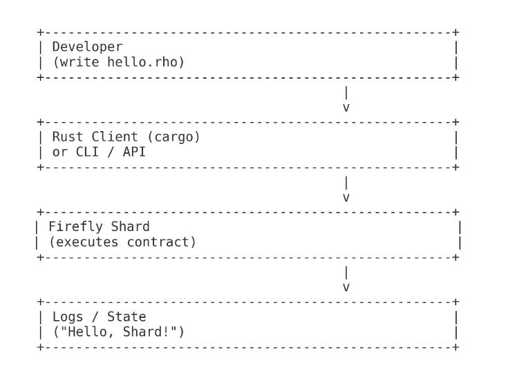

*Diagram – illustration only, not executable code*

> 📝 **NOTE**
> All examples in this guide use the Docker Compose setup from `f1r3node/docker/`.
> Alternative paths (CLI, Kubernetes/Helm) are provided in **Appendix A** (advanced/optional).

---

## TL;DR QuickStart (for experts)

If you want to see a shard running and responding in under five minutes, here’s the shortest possible path.

### 1. Clone the repo

```bash
git clone https://github.com/F1R3FLY-io/f1r3fly.git
cd f1r3fly/docker
# This is the main Firefly repository (contains the shard and Docker configs).
```

### 2. Generate keys and certificates

```bash
./configure-shard.sh
```

### 3. Launch with Docker Compose (autopropose profile)

```bash
docker compose -f shard-with-autopropose.yml up -d
```

**You should see output like this:**

```
[+] Running 6/7
 ⠧ Network docker_f1r3fly      Created 0.7s
 ✔ Container rnode.validator3  Started 0.4s
 ✔ Container rnode.bootstrap   Started 0.3s
 ✔ Container rnode.validator1  Started 0.5s
 ✔ Container rnode.validator2  Started 0.2s
 ✔ Container rnode.observer    Started 0.6s
 ✔ Container autopropose       Started 0.6s
```

---

### 4. Tail logs to confirm healthy startup

```bash
docker compose -f shard-with-autopropose.yml logs -f rnode.bootstrap
```

---

### 5. Check shard health

```bash
curl http://127.0.0.1:40403/status
```

**Expected output:**

```
{"address":"rnode://505a9aeff537e99122baa8ddc03b354010528b04@rnode.bootstrap?protocol=40400&discovery=40404","version":"RChain Node 1.0.0-SNAPSHOT","peers":4,"nodes":4}
```

You should see **4 peers** and **4 nodes**, which matches the default configuration.

---

### 6. Minimal Rholang deploy ("Hello, Shard!")

Before running a minimal deploy, clone the Rust client:

```bash
git clone https://github.com/F1R3FLY-io/rust-client.git
cd rust-client
```

>⚠️ **WARNING — Pending Developer Confirmation**  
The deploy command is currently being updated by Stephen.  
Until the new CLI syntax is finalized, the deploy step remains on hold.

```
Deploy command — pending confirmation
<updated command will be added here after CLI refactor completes>
```

Once the updated command is available, validators will be able to:

- submit the smoke-test contract (`stdout.rho`)
- verify block inclusion
- confirm `"Hello, Shard!"` in logs

---

### Repositories used in this guide

**Main node repo**  
https://github.com/F1R3FLY-io/f1r3fly  
Contains the shard implementation and Docker configs.

**Rust client repo**  
https://github.com/F1R3FLY-io/rust-client  
Used later for interaction, queries, and deployments.

---

> 💡 **TIP**  
> This TL;DR assumes Docker is installed and running.  
> If you're on Apple Silicon or haven’t installed Docker yet, go to §2 Prerequisites.

> 📝 **NOTE**  
> Rust client is only required later — not during initial shard launch.

> 👉 **NEXT:** 
> **§1 Introduction** — What is a shard and why it matters. 
## §1 Introduction — What is a shard and why it matters

When you launch Firefly, you are not starting a “big chain in the sky.”  
You are starting **your own shard** — a local blockchain instance that runs independently but can later connect to others.

Think of a shard (`f1r3node`) as a sandboxed universe:

- It has its own processes, registry, and logs.  
- It can run contracts in isolation.  
- It can communicate with other shards once they are connected.

#### Why is this important?

- **For developers** — a shard is your personal testbed: you can deploy Rholang, break things, and restart safely.  
- **For operators** — shards are building blocks of Firefly’s multi-shard network. Each shard can scale, restart, and evolve independently.

The goal of this section is simple:  
**By the end of Part I, you will have a fully running Firefly shard that can accept Rholang contracts, respond to health checks, and prove it is alive.**

---
**Shard State**
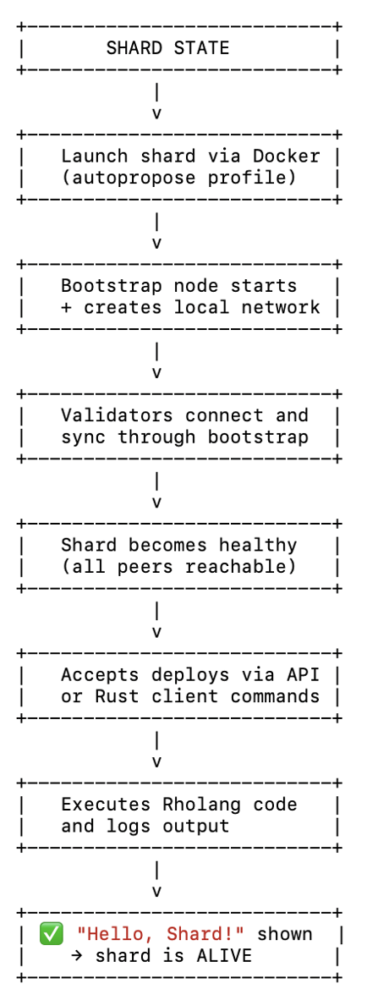
*Diagram — illustration only, not executable code*

> 💡 **TIP**  
> If you come from Web2, think of a shard like a local web server you spin up for development.  
> In Web3, this “server” happens to be a blockchain node.

> 📝 **NOTE**  
> You don’t need to understand consensus algorithms or reduction semantics yet.  
> Just follow the steps and confirm your shard is alive.

>👉 **NEXT**  
**§2 Prerequisites** — What you must have in place before touching configs or launch commands.

---
## Configuration — Preparing your shard’s local settings

You’ve checked your prerequisites — Docker is running, your machine is ready. Now it’s time to configure the local settings that determine how your shard will run. Think of this step as tuning an instrument before a concert: your shard will not perform correctly unless the configuration is clean and consistent.

## Level 1 — Quick Path (Minimal Configuration)

Recommended for experts who just want the shard running quickly.

Navigate to the repo root.
```bash
cd f1r3fly
```
### Run the configuration script

This script prepares all required config files, including:
- `docker/.env` — ports, hosts, validator key references
- `conf/shared-rnode.conf` — full node configuration (≈500 lines)
- `docker/certs/` — certificates for bootstrap + validator nodes

Run:
```bash
./configure-shard.sh
```
You do NOT need to edit .env, certificates, or shared-rnode.conf manually for the demo shard.

### Default ports (do not modify unless necessary)

| Component           | Port  |
|--------------------|-------|
| HTTP/Health        | 40403 |
| Admin HTTP         | 40405 |
| gRPC External (TLS)| 40401 |
| gRPC Internal      | 40402 |

### Validate the merged configuration
```bash
docker compose -f docker/shard-with-autopropose.yml config
```
>**👉 NEXT** 
>If this prints a merged config without errors, you’re ready to §4 Launching the Shard.

>**💡 TIP**
>Firefly no longer uses local.yaml.  
>All configuration now comes from:  
>- `conf/shared-rnode.conf`  
>- `docker/.env ` 
>- Docker Compose files.
## Level 2 — Standard Walkthrough

This section explains where each configuration file lives and how the shard uses them.

### Locate configuration files

**1. Compose files (`docker/`):**

- `shard-with-autopropose.yml`  
  Main shard configuration with bootstrap + validator nodes.
- `observer.yml`  
  Optional read-only observer node.

---

**2. Shared node configuration (`conf/shared-rnode.conf`):**

This file is loaded by every node at startup. It contains:

- validator definitions  
- genesis wallets  
- runtime parameters  
- shard identity  

**TLS/security configuration**  
Developers and testers will often need to modify this file — but not during the Quick Path.

---

**3. Certificates (`docker/certs/`):**

Directory containing:

- TLS certificates for bootstrap  
- TLS certificates for validators  
- certificate/key pairs generated by `configure-shard.sh`  

These must match the entries in `shared-rnode.conf` and `.env`.

---

**4. Environment file (`docker/.env`):**

Central source for:

- port bindings  
- hostnames  
- validator key references  
- external service endpoints  

>⚠️ **WARNING — MUST be consistent with:**
>- `conf/shared-rnode.conf`  
>- `docker/certs/`

### Edit `.env`

Open `docker/.env` and set only what you need. Keep placeholders in docs/screenshots:
```bash
BOOTSTRAP_NODE_ID=<id>
BOOTSTRAP_PUBLIC_KEY=<pub-key>
BOOTSTRAP_PRIVATE_KEY=<priv-key>
BOOTSTRAP_HOST=rnode.bootstrap

VALIDATOR1_HOST=rnode.validator1
VALIDATOR2_HOST=rnode.validator2
VALIDATOR3_HOST=rnode.validator3

READONLY_HOST=rnode.readonly   # optional
```

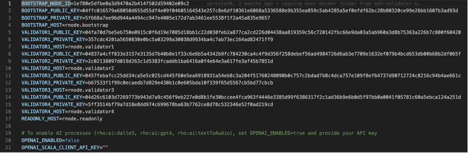
>🔒 **SECURITY**  
Never commit real keys. Always use `<PRIVATE_KEY>`, `<PUB_KEY>`, `<HOST>`.

>💡 **TIP**  
Share a redacted `.env.example` in repos, but keep your real .env local and untracked.

### **Ports & interfaces**

- HTTP API server → 40403  
- Admin HTTP API server → 40405  
- External API (gRPC) → 40401  
- Internal API (gRPC) → 40402  
- Protocol port → 40400  
- Discovery (Kademlia) → 40404  

⚠️ **WARNING**  
If any of these ports are already in use, Docker will fail to start the shard containers.  
Resolve conflicts (via `lsof` or Activity Monitor) before launching.

### **Apple Silicon (arm64)**  
- Prefer multi-arch Docker images.  
- If only amd64 is available, enable Rosetta 2.

### **Validate configuration**  
Run:

```bash
docker compose -f docker/shard-with-autopropose.yml config
```

  ✅ Success → merged config appears.  
  ❌ Error → check:  
  - `.env` syntax (`KEY=VALUE`, no quotes),  
  - duplicate ports,  
  - run from repo root.  

>💡 **TIP**  
Most startup issues come from `.env` typos or port conflicts.

## Level 3 — Deep Dive

### Node roles at a glance
- **Bootstrap** → seeds the network topology.  
- **Validators** → run consensus and execute blocks.  
- **Observer** → read-only, safe for queries/logs.  
  *(Does not participate in consensus or block production.)*
  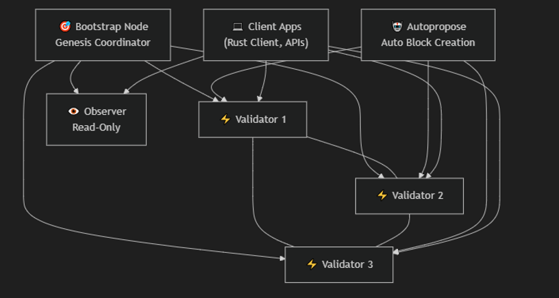

### Secrets & version control

`.env` must NEVER be committed to Git. Only. `env.example` is committed — and only with fake keys.

**Correct workflow:**

1. Developers generate their own keys using the supported keygen tools:  
   - `rnode keygen` (for validator keys)  
   - `rust-client keygen` (for client/transaction keys)

2. `.env.example` must contain ONLY placeholders:  
```bash
BOOTSTRAP_PUBLIC_KEY=<GENERATED_PUB_KEY>
BOOTSTRAP_PRIVATE_KEY=<GENERATED_PRIV_KEY>
```
and NEVER real values.

3. Real `.env`:  
- created manually on every machine  
- stored locally  
- always gitignored  
- contains real generated values

4. Every key shown in docs must be fake, never from the repo.

>🔒 **SECURITY**  
Every `<PUBLIC_KEY>` and `<PRIVATE_KEY>` in this document must be fake and must not match any real validator/genesis key from the repository.
## Overrides & customizations

Advanced users may create a local-only override file:  
`docker-compose.override.yml`

**Location:**  
`/docker/docker-compose.override.yml`

**Purpose:**  
- mounting local volumes  
- enabling debug logging  
- overriding ports  
- attaching profilers or monitoring tools

**Example override:**
```bash
version: "3.9"
services:
  validator1:
    logging:
      driver: json-file
      options:
        max-size: "10m"
    volumes:
      - ./logs/validator1:/var/log/firefly
```
>📝 **NOTE**  
Overrides are fully optional — the default shard works without them.

### Sanity checklist

- Docker + Docker Compose installed and working  
- Repository cloned; `docker/` folder present  
- `.env` created locally from `.env.example` using your own generated keys  
- `docker compose -f shard-with-autopropose.yml config` prints a merged config without errors  
- Optional: `observer.yml` prepared if needed.

>👉 **NEXT**  
**§4 Launching the Shard** — the actual “go” button.
## 4. Launching the Shard — The “Go” Button

Configuration is done — now it’s time to actually start your shard.  
This step transforms configs into a living blockchain process.

### Level 1 — Quick Path (Fastest Launch)

For experts who just want to see it run (from project root).

Launch the shard (bootstrap + validators):

```bash
docker compose -f docker/shard-with-autopropose.yml up -d

docker compose ps
```
- First command starts the shard (bootstrap + validators).  
- Second shows running services.

Check logs for activity:

```bash
docker compose -f docker/shard-with-autopropose.yml logs -f
```
Expected: blocks proposed, health check live.

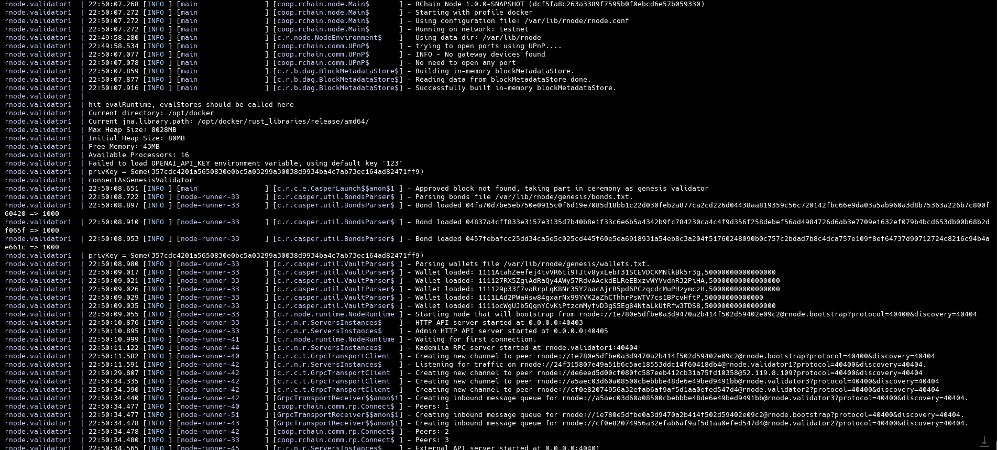
>**💡 TIP**
Use `-d` for detached mode. Omit it if you want logs streaming immediately.
### Level 2 — Standard Walkthrough

#### Start the shard

Run:

```bash
docker compose -f docker/shard-with-autopropose.yml up -d
```
  This spins up:
  - **bootstrap** node (network seed),
  - **validator** nodes (consensus),
  - **autopropose** service (ensures blocks are produced automatically).
  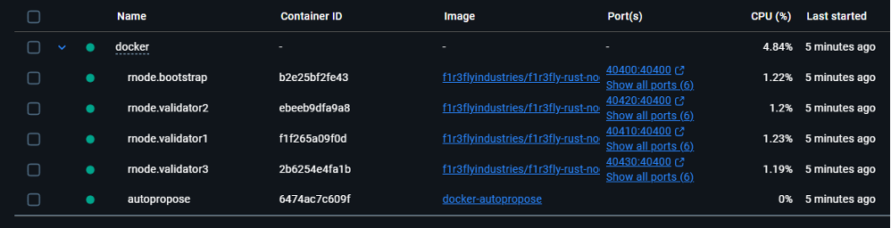
  #### Verify containers

Check what’s running:

```bash
docker compose ps
```
You should see `bootstrap`, `validator1`, `validator2`, `validator3`, and autopropose.
>**📝 NOTE**
Service names may differ slightly — always confirm with `docker compose ps`.

#### Observe logs
Pick a `validator` (e.g. `validator1`):
```bash
docker compose -f docker/shard-with-autopropose.yml logs -f `<SERVICE_NAME>`
```

>📝 **NOTE**
Here `<SERVICE_NAME>` replaces validator1 — confirm with `docker compose ps`.

Expected:
- Block proposals every 30 seconds (autopropose default).
- No crash loops or port errors.

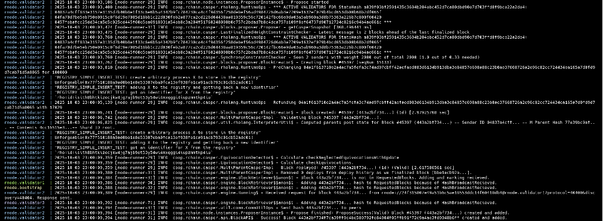

#### Health check
Query the HTTP status endpoint:
```bash
curl http://127.0.0.1:40403/status
```
Optionally, check health endpoint curl 
http://127.0.0.1:40403/health

Expected response:
```bash
{"address":"rnode://1e780e5dfbe0a3d9470a2b414f502d59402e09c2@rnode.bootstrap?protocol=40400&discovery=40404","version":"RChain Node 1.0.0-SNAPSHOT (dcf5fa8c263a3389f7595b0f0ebcd6e57b059330)","peers":3,"nodes":4}
```

>⚠️ **WARNING**
If this fails, check logs for port collisions or misconfigured `.env`
#### Add a read-only node (Optional)
Want a safe query node? Start observer:
```bash
docker compose -f docker/observer.yml up -d
```

Then tail logs:
```bash
docker compose -f docker/observer.yml logs -f observer
```

Observer does not participate in consensus — it’s perfect for API queries.


>💡**TIP**
Use an observer for dashboards, bots, or integration tests.

### Level 3 — Deep Dive
What happens under the hood
- Bootstrap: initializes shard topology.
- Validators: reach consensus, propose and validate blocks.
- Autopropose: automatically triggers block proposals — without it, your deploys may remain pending. It simulates real network activity.
- Observer: optional node that mirrors state without voting rights.

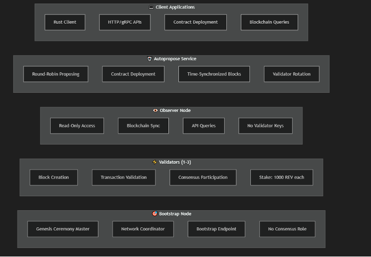

#### Logs & troubleshooting
Common issues at launch:
- Port in use → update .env or stop conflicting service.
- Crash loop → check invalid .env formatting (must be KEY=VALUE).
- No proposals → ensure autopropose is running; otherwise, blocks won’t be created.
>📝 **NOTE**
You can stop/restart the shard safely:
> - Stop all containers safely
docker compose `-f docker/shard-with-autopropose.yml` down
> - Restart fresh
docker compose `-f docker/shard-with-autopropose.yml up -d`

#### Clean shutdown checklist
Before stopping:
- Save logs if debugging.
- Back up state if needed (inside `docker/data/`).
- Use docker compose down (without `-v`) to keep state across restarts.
>💡 **TIP**
Developers often keep the same state across multiple sessions to simulate continuity.

#### Ready to deploy
Once status check returns
```bash
{"address":"rnode://1e780e5dfbe0a3d9470a2b414f502d59402e09c2@rnode.bootstrap?protocol=40400&discovery=40404","version":"RChain Node 1.0.0-SNAPSHOT (dcf5fa8c263a3389f7595b0f0ebcd6e57b059330)","peers":3,"nodes":4}
```

your shard is live. You can now proceed to Part II and deploy Rholang contracts.
>👉 **NEXT**
**§5 Observing Startup & Logs** — more detail on what to look for in your shard’s output.
## 5. Observing Startup & Logs
Launching the shard is just the first step — now you need to confirm it’s actually alive and behaving. Logs are your shard’s heartbeat: they tell you what’s happening inside.

### Level 1 — Quick Path (Fastest Check)

```bash
docker compose -f docker/shard-with-autopropose.yml logs -f <SERVICE_NAME>
```

>**📝 NOTE**
Here `<SERVICE_NAME>` replaces validator1 — `confirm with docker compose ps`.

Look for:
- Messages like “Proposed block …” (autopropose working).
- No crash loops or repeated errors.
If you see blocks being proposed and no red errors, your shard is healthy.
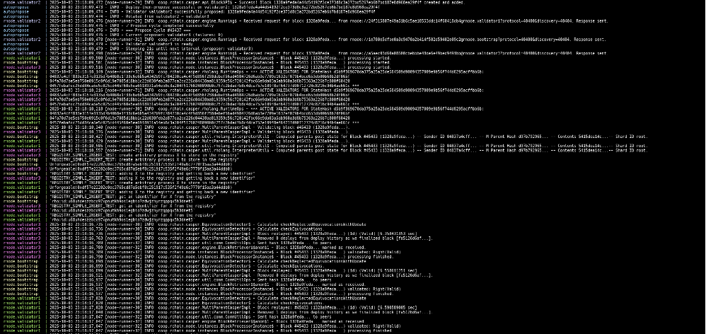

> **💡 TIP**
Always check at least one validator log after startup.

### Level 2 — Standard Walkthrough
#### Follow logs of a validator
**Run:**
```bash
docker compose -f docker/shard-with-autopropose.yml logs -f <SERVICE_NAME>
```


**Expected messages:**
●	“Starting node …” → node boot sequence.
●	“Connected to bootstrap …” → networking works.
●	“Proposed block #…” → consensus/blocks live.
>**📝 NOTE**
If `validator1` is not found, confirm the service name with: `docker compose ps`

#### Look for health signs
- Autopropose cycle: every ~30 seconds (default), a validator proposes a new block.
- No “port already in use” errors.
- No crash/restart loops (services should stay up).
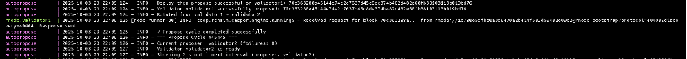

#### Common warnings you can ignore
●	Occasional “timeout waiting for peer” — normal during bootstrap.
●	“Validator not leader this round” — normal in consensus.
>**⚠️ WARNING**
Repeated red errors (e.g., “invalid private key” or “port conflict”) are not normal — fix `.env` or port settings.
#### Health endpoint check (parallel)
While logs run, confirm via health API:
curl http://127.0.0.1:40403/status

*Expected:* 
```bash
{"address":"rnode://1e780e5dfbe0a3d9470a2b414f502d59402e09c2@rnode.bootstrap?protocol=40400&discovery=40404","version":"RChain Node 1.0.0-SNAPSHOT (e30fc2ceb2c98c133d265e0748085c7ee9307b9b)","peers":3,"nodes":4}
```
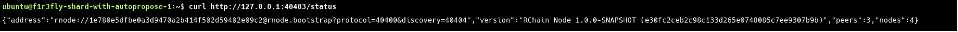

>**💡 TIP**
Use both logs and status endpoint. Logs give context; endpoint confirms service readiness.

### Level 3 — Deep Dive
What each node shows in logs
- Bootstrap: peer connections, handshakes.
- Validators: propose/validate blocks, consensus decisions.
- Observer: query handling, but no block proposals.
>**📝 NOTE**
The observer node mirrors shard state but doesn’t take part in block production.
#### Filtering logs
Follow logs for a specific service:
```bash
docker compose -f docker/shard-with-autopropose.yml logs -f <SERVICE_NAME>
```
>**📝 NOTE**
Here `<SERVICE_NAME>` replaces validator1 — confirm with 
`docker compose ps`


Limit to last N lines:
```bash
docker compose logs --tail=100 <SERVICE_NAME>
```

>**💡 TIP**
For debugging, redirect logs to a file:
```bash
docker compose logs <SERVICE_NAME> > <SERVICE_NAME>.log
```

 
**This will:**
✅ Capture the logs from the chosen service
✅ Redirect them to `<SERVICE_NAME>.log`
⚠️ Only capture logs that exist at the time of running the command (not live logs)
If you want to capture logs as they happen (like tail -f), use:

*Capture live logs to file*
```bash
docker compose logs -f <SERVICE_NAME> > <SERVICE_NAME>.log
```

*Or append to existing file*
```bash
docker compose logs -f <SERVICE_NAME> >> <SERVICE_NAME>.log
```

#### Recognizing trouble early
- Crash loops → service restarts repeatedly.
- No proposals → autopropose missing or misconfigured.
- Health API down → service not exposing correctly.

>**📝 NOTE**
Most launch failures trace back to `.env` or `.yml` misconfig (bad key, wrong port, missing variable).

#### Checklist: healthy startup
- Validator logs show block proposals.
- No repeating errors.
- 	Status endpoint returns `{ "status": "OK" }`.
- Observer (if enabled) responds to queries.
>**👉 NEXT**
**§6 Health Checks** — making API-based checks part of your workflow.

## 6. Health Checks — Proving Your Shard is Alive
Launching and observing logs is good, but developers need programmatic checks to prove a shard is healthy. Health checks let you confirm that services are reachable, responsive, and ready to accept deploys.

### Level 1 — Quick Path (Minimal Command)

**Run:**
```bash
curl http://127.0.0.1:40403/status
```

**Expected:**
```bash
{"address":"rnode://...@rnode.bootstrap?protocol=40400&discovery=40404","version":"RChain Node ...","peers":3,"nodes":4}
```

**Optional health probe:**
```bash
curl http://127.0.0.1:40403/health
```

**Expected:**
`{"status":"OK"}`

>**💡 TIP**
Port `40403` is the canonical HTTP/status  endpoint (unless overridden in `.env`).

### Level 2 — Standard Walkthrough
#### Check validator status
*Default health check:*
`curl http://127.0.0.1:40403/status`

**This confirms:**
- The container is running
- HTTP API bound to the expected host/port
- Consensus loop is alive (peer & node counts progress over time)

#### Service discovery
If you’re unsure of service names or ports:
`docker compose ps`
→ Shows container names and published ports.
Example mapping: `0.0.0.0:40453->40403/tcp` means you should query:
```bash
curl http://127.0.0.1:40453/status
```

>**📝 NOTE**
Always confirm actual mappings — compose profiles (e.g., observer.yml) may expose `40403` inside the container on a different host port (e.g., `40453`) on your machine.

#### Observer node check (optional)
If you started the observer:
```bash
curl http://127.0.0.1:<OBSERVER_PORT>/status
```
Should also return status JSON or {`"status":"OK"`} via /health.
>**💡 TIP**
Observers are perfect for dashboards or bots: they expose state without affecting consensus.
#### Debugging failed health checks
- Connection refused → container not running, wrong port, or firewall.
- Empty/garbled response → check logs:
```bash
docker compose logs <SERVICE_NAME>
```
- Deploys later stuck “Pending” → autopropose not running → no blocks proposed.
>**⚠️ WARNING**
Don’t continue to deploy contracts until the health check is green. Everything else will fail.
#### Automating checks (CI or local scripts)
Wait until peers are non-zero:
```bash
until curl -s http://127.0.0.1:40403/status | grep -q '"peers":[1-9]'; do
  echo "Waiting for shard..."
  sleep 3
done
echo "Shard is healthy!"
```

>**💡 TIP**
Always gate tests/deploys on a positive health check.

### Level 3 — Deep Dive
#### Extended HTTP API (for monitoring/diagnostics)

**List recent blocks**
```bash
curl http://127.0.0.1:40403/api/blocks
```

**Inspect a specific block**
```bash
curl http://127.0.0.1:40403/api/block/<BLOCK_HASH>
```

**OpenAPI / schema (endpoints may vary by build)**
```bash
curl http://127.0.0.1:40403/api/v1/openapi.json
```

>**📝 NOTE**
Exact endpoints depend on the build version and the Rholang API version. Check `openapi.json` to confirm availability

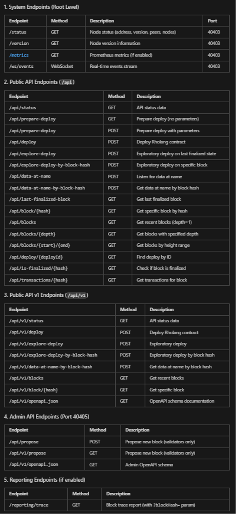

#### Client-level liveness (Rust client)
Rust client can verify liveness indirectly:
```bash
cargo run -- get-deploy -d <DEPLOY_ID>
```

If the shard is unhealthy, this call will hang or error — useful to verify both network & consensus layers.
>**💡 TIP**
Client-level checks are valuable because they confirm both network and consensus layers.
#### Monitoring in production
- Export health metrics to Prometheus/Grafana; add alerts if /health or /status fails N times.
- Use observer nodes to offload monitoring traffic.
- Track block production pace (autopropose) and peer counts.

#### Troubleshooting checklist
✅ curl /status (or /health) returns expected `JSON `→ shard alive
❌ Connection refused → container not started (check `docker compose ps`)
❌ No "OK" or malformed JSON → re-check .`env / port` mappings
❌ Deploys stuck “Pending” → ensure autopropose is enabled and running

>**👉 NEXT**
**§7 First Verification Action** — deploying a minimal Rholang contract to prove the shard is not only alive, but executing code
## 7. First Verification Action — Deploy “Hello, Shard!”
You’ve launched your shard, observed healthy logs, and passed the health check. Now it’s time for the ultimate proof: deploying a Rholang contract and seeing it execute.

### Level 1 — Quick Path (Fastest Hello)

**Deploy with the Rust client:**
```bash
cargo run -- deploy -f ./rho_examples/stdout.rho
```
**Then check status:**
```bash
cargo run -- get-deploy -d  <DEPLOY_ID>
```

**Finally, confirm in logs:**
```bash
docker compose -f docker/shard-with-autopropose.yml logs -f 
```
**Expected output:**
`Hello, Shard!`

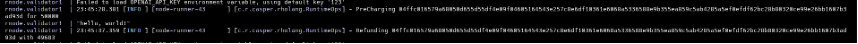

>**💡 TIP**
If you see both “included in block” in show-deploy and “Hello, Shard!” in logs — your shard is alive and executing.

### Level 2 — Standard Walkthrough
#### Prepare a contract
Create a minimal Rholang file hello.rho:

```bash
  new stdout(`rho:io:stdout`) in {
  stdout!("Hello, Shard!")
}
```
Save it under `rholang/examples/hello.rho` (or any path; just remember it).

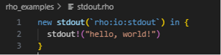

#### Deploy using the Rust client
**Run:**
```bash
cargo run -- deploy -f ./rho_examples/stdout.rho
```
**Expected output:**
```bash
📄 Reading Rholang from: ./rho_examples/stdout.rho
📊 Code size: 62 bytes
🔌 Connecting to F1r3fly node at localhost:40412
💰 Using phlo limit: 50,000
🚀 Deploying Rholang code...
🔢 Current block: 40
✅ Setting validity window: blocks 40 to 90 (50-block window)
✅ Deployment successful!
⏱️  Time taken: 27.76ms
🆔 Deploy ID: 304402204ddfb07385efb57856f8377a2dce32fe9664c1dc73c6ffdf47e8367c5465ca1502205e6355ff5ff0a76070a1d89fcda4a342074267a0c3e434bd0f68438ac802b2d2
```
>**📝 NOTE**
The `<DEPLOY_ID>` is your handle for querying deploy status.

#### Verify deploy status
**Check status with:**
```bash
cargo run -- get-deploy -d <DEPLOY_ID>
```
**Expected outcome:**
The deploy will appear in the node’s history once it’s included in a block.
When the block is finalized, the deploy is considered complete.
>**⚠️ WARNING**
If your deploy never shows up, autopropose may not be running. Confirm it with:
```bash
docker compose ps
```
#### Confirm output in logs
Tail validator logs:
```bash
docker compose logs -f validator1
```
Expected line:
`"Hello, Shard!"`

>**💡 TIP**
Logs confirm stdout. Status check confirms consensus. Use both.

### Level 3 — Deep Dive
#### Using environment variables
Instead of passing flags each time, export them once:
```bash
export NODE_URL=http://127.0.0.1:40403
export PRIVATE_KEY=<PRIVATE_KEY>
```
Then run deploys without repeating `--node / --private-key`.
>**📝 NOTE**
Never expose real keys in shared shells. Always use placeholders in docs.
#### Observer node for safe verification
If observer is running, query it for deploy status without touching consensus nodes:
```bash
curl http://127.0.0.1:<OBSERVER_PORT>/api/deploy/<DEPLOY_ID>
```
Expected JSON:
```bash
{"blockHash":"c39b7b904d882d22706d2351484df89d18a1e5d8e56e38322262a3eea6e9a540","sender":"04fa70d7be5eb750e0915c0f6d19e7085d18bb1c22d030feb2a877ca2cd226d04438aa819359c56c720142fbc66e9da03a5ab960a3d8b75363a226b7c800f60420","seqNum":15,"sig":"3045022100ee1a031a59129383b71de49712e995067676979bdfc4b737697363b4d6b4f96902206d97336e13ce5063f475551859f4806980e2f78959fab37dfd8a758073b895db","sigAlgorithm":"secp256k1","shardId":"root","extraBytes":"","version":1,"timestamp":1759535128362,"headerExtraBytes":"","parentsHashList":["53b9f6228ce7e7aa86a28ee959c619d8171ce20bf048a8f10eed2d54f9827a68"],"blockNumber":43,"preStateHash":"fe95f046d7c8344596a166dfa6342b52f8705b91bce57ce7271606e64368f3c8","postStateHash":"01eb2234ddc9c0330c4462c41e0ff3616756288b0a1118904786557b713fa6e3","bodyExtraBytes":"","bonds":[{"validator":"04837a4cff833e3157e3135d7b40b8e1f33c6e6b5a4342b9fc784230ca4c4f9d356f258debef56ad4984726d6ab3e7709e1632ef079b4bcd653db00b68b2df065f","stake":1000},{"validator":"04fa70d7be5eb750e0915c0f6d19e7085d18bb1c22d030feb2a877ca2cd226d04438aa819359c56c720142fbc66e9da03a5ab960a3d8b75363a226b7c800f60420","stake":1000},{"validator":"0457febafcc25dd34ca5e5c025cd445f60e5ea6918931a54eb8c3a204f51760248090b0c757c2bdad7b8c4dca757e109f8ef64737d90712724c8216c94b4ae661c","stake":1000}],"blockSize":"102938","deployCount":1,"faultTolerance":1.0,"justifications":[{"validator":"0457febafcc25dd34ca5e5c025cd445f60e5ea6918931a54eb8c3a204f51760248090b0c757c2bdad7b8c4dca757e109f8ef64737d90712724c8216c94b4ae661c","latestBlockHash":"53b9f6228ce7e7aa86a28ee959c619d8171ce20bf048a8f10eed2d54f9827a68"},{"validator":"04837a4cff833e3157e3135d7b40b8e1f33c6e6b5a4342b9fc784230ca4c4f9d356f258debef56ad4984726d6ab3e7709e1632ef079b4bcd653db00b68b2df065f","latestBlockHash":"5ed7a0228f765e6fb462d65f045a4b87d783c339dfc566b69bef74674799c859"},{"validator":"04fa70d7be5eb750e0915c0f6d19e7085d18bb1c22d030feb2a877ca2cd226d04438aa819359c56c720142fbc66e9da03a5ab960a3d8b75363a226b7c800f60420","latestBlockHash":"ffb8e67b8ab918396f47630aa210a75fd4980cff0915403bd311a2a61486d8bd"}],"rejectedDeploys":[]}
```

>**💡 TIP**
Observer is ideal for dashboards, bots, and CI/CD verification.
#### Advanced contract checks
Not all contracts log output. For richer verification:
- Use return channels (ack) to get function-like results.
- Persist values in the registry and query them later.
- Inspect deploy metadata via API (`cost, blockHash`).
#### Troubleshooting deploys
- `cargo: command not found` → Rust not installed.
- `Invalid signature` → wrong/missing private key in `.env`.
- `show-deploy` never executed → autopropose not running.
-  No `Hello, Shard!` in logs → wrong file path or typo in contract.
>**📝 NOTE**
Every failed deploy is either the environment (wrong key, wrong path) or language (syntax error). Classify early.
#### Success checklist
- `show-deploy` shows included in block.
- Logs show `“Hello, Shard!”`.
- The health endpoint still returns OK.
- Deploy metadata accessible via API.
>**👉 NEXT**
**§8 Common Pitfalls & Fixes** — compact table of real-world errors and one-line solutions.

## 8. Common Pitfalls & Fixes
Even with clear steps, developers will hit errors. Don’t panic — most issues are predictable and easy to fix. This section is your quick troubleshooting guide.
### Level 1 — Quick Wins (Beginner Errors)

#### Symptom → Fix
❌ `node not reachable `→ Shard not running or wrong URL.
✅ Check with:
```bash
curl http://127.0.0.1:40403/status
```

❌ `cargo: command not found` → Rust not installed.
✅ Install Rust using rustup (https://rustup.rs/) and re-run.

❌ `No such file: ./contracts/hello.rho` → Wrong path.
✅ Verify file exists and adjust --file.

 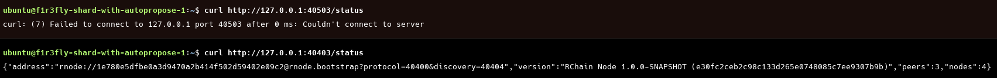

>**💡 TIP**
Most Level 1 issues are setup-related. Fix them once, and you’ll rarely see them again.

### Level 2 — Language & Syntax Errors

#### Common Rholang mistakes:
❌ `Unexpected token '}'` → syntax typo.
✅ Fix parentheses/braces nesting.

❌ `Unbound variable` → using a name without new.
✅ Declare variable first.

❌ `Match error` → wrong pattern.
✅ Align match with actual data.
Example:
```bash
stdout!("hi")     // ❌ Error: unbound name 'stdout'

new stdout(`rho:io:stdout`) in {
  stdout!("hi")   // ✅ Correct
}
```

>**📝 NOTE**
Every send `(chan!(x))` needs a matching receive `(for(x <- chan))`, and vice versa.

### Level 3 — Advanced Issues (Deployment & Execution)
#### Invalid deploy signature
❌ Wrong or missing private key.
✅ Check `.env`, use correct `<PRIVATE_KEY>`.
#### Deploy too large
❌ Contract exceeds node’s size limit.
✅ Split the contract or adjust phlo/cost settings if supported.
#### Deploy stuck in pending
❌ Autopropose not running or proposer misconfigured.
✅ Ensure `autopropose` service is running (`docker compose ps`).
#### Registry lookup fails
**Typical causes:**
- Typo in string
- Name was never registered
- Registered under another key (wrong signing key)
- Registered in another shardId
- Capability mismatch (wrong usage of returned channel)
**Symptoms:** 
– empty lookup result
– Not found
– or valid capability returned but deploy produces no effect
**Correct example:**
```bash
for(target <- registryLookup!("calc:latest")) {
  @target!(42)
}
```

>**💡 TIP**
Registry issues are almost always caused by (1) wrong name, (2) wrong key, or (3) wrong shard context.

>**⚠️ WARNING**
Advanced issues often come from capability mismanagement — wrong key, wrong registry name, or mismatched contracts. Precision matters.

#### Troubleshooting Workflow (Cheat Sheet)

1️⃣ Check environment → Is shard running? Rust installed?
2️⃣ Check syntax → Validate contract compiles (start with hello.rho).
3️⃣ Check execution → show-deploy, logs, API.
4️⃣ Check names/keys → Ensure correct private key and registry strings.

>**💡 TIP**
Classify errors:
>- Environment problem → fix configs.
>- Language problem → fix Rholang syntax.
#### Success Checklist
- Environment issues fixed (shard running, Rust installed).
- Contract syntax validated.
- Deploy executed, not stuck pending.
- Registry names and keys are correct.
>**👉 NEXT**
**§9 Shut Down & Clean Up**— how to gracefully stop and reset your shard.
## 9. Shut Down & Clean Up — Stopping Your Shard Safely
At some point, you’ll need to stop your shard. Maybe you’re done testing, need to reset state, or want to free resources. This section covers how to shut down gracefully and when to wipe data.
### Level 1 — Quick Path (Stop Everything)

To stop containers but keep state:
```bash
docker compose -f docker/shard-with-autopropose.yml down
```
To stop and wipe all data:
```bash
docker compose -f docker/shard-with-autopropose.yml down && rm -rf docker/data
```
>**💡 TIP**
Use `rm -rf docker/data` only if you want a clean slate — it deletes all volumes (your shard’s blockchain state).

### Level 2 — Standard Walkthrough
#### Stop the shard
Run from repo root:
```bash
docker compose -f docker/shard-with-autopropose.yml down
```
**Expected**: all containers stopped.
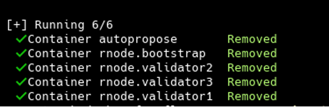
#### Confirm shutdown
List containers:
```bash
docker ps
```
**Expected:** no `bootstrap`, `validator*`, or `autopropose` containers running.
>**📝 NOTE**
If you started observer, shut it down too:
`docker compose -f docker/observer.yml down`
####
Preserve or reset state
- Preserve state: `run docker` compose down (without `-v`). Your blockchain data in docker/data/ stays.
- Reset state: `run rm -rf docker/data`. This wipes volumes, removing all shard state.
>**⚠️ WARNING**
Wiping volumes resets your shard to “genesis” state. All previous contracts, keys, and blocks are lost.
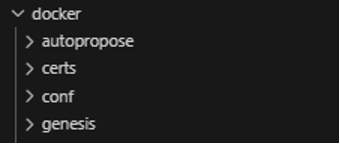

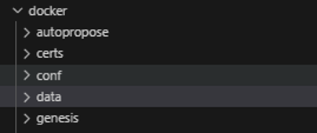

#### Restart cleanly
To restart from scratch:
```bash 
docker compose -f docker/shard-with-autopropose.yml up -d
```
Shard will regenerate from genesis.
>**💡 TIP**
Developers often wipe (`rm -rf docker/data`) between experiments for reproducibility. Teams typically preserve state between sessions.

### Level 3 — Deep Dive
#### Cleaning logs
If logs grow large:
```bash 
**docker compose -f docker/shard-with-autopropose.yml logs --no-log-prefix --timestamps > shard.log**

rm -rf data/*/rnode.log
rm -rf data/*/logs/*
```

Archive logs before wiping for debugging.
#### Selective cleanup
**You can remove only specific services:**
Stop specific validator
```bash 
docker compose -f docker/shard-with-autopropose.yml stop validator2**
```

Remove specific validator container
```bash 
docker compose -f docker/shard-with-autopropose.yml rm -f validator2**
```
Clean up validator2's data directory
```bash 
rm -rf data/rnode.validator2/
```
Restart the specific validator
```bash 
docker compose -f docker/shard-with-autopropose.yml up -d validator2**
```
Useful if one validator misbehaves but you don’t want to reset the whole shard.
### File system state
Shard data is mounted in docker/data/ (volumes).
- Back up before experiments if you want reproducibility.
- Delete manually if you want to force a fresh start.
>**📝 NOTE**
Always communicate with your team before wiping shared volumes.
#### Checklist for safe cleanup
- All containers stopped (`docker ps` empty).
- Logs saved (optional).
- Volumes either preserved (default) or wiped (`rm -rf docker/data`).
- Repo ready for next launch.
>**👉 NEXT**
**§ 10 Artifacts Capture Checklist** — One-Pass Run A one-stop checklist to capture all commands, logs, and screenshots from a single shard run, ensuring reproducibility and complete documentation.
## 10. Artifacts Capture Checklist — One-Pass Run
This checklist ensures you capture all essential artifacts in a single run of your shard. Use it for QA, documentation, or onboarding.
### Environment
●	Docker installed (`docker --version`)
●	Docker Compose installed (`docker compose version`)
●	Rust client installed (`cargo run -- help`)
●	Repo cloned (`F1R3FLY-io/f1r3node`)
●	`docker/.env` prepared with placeholders (`<PRIVATE_KEY>`, `<PUB_KEY>`)
### Launch & Services
Launch shard
```bash
docker compose -f docker/shard-with-autopropose.yml up -d
```
Verify containers:
```bash
docker compose ps
```
→ expect bootstrap, validator1–3, autopropose.

### Logs & Health
Tail validator logs:
```bash
docker compose -f docker/shard-with-autopropose.yml logs -f validator1
```
→ expect block proposals.
Health endpoint:
```bash
curl http://127.0.0.1:40403/health

```
→ `{ "status": "OK" }.`
### First Deploy
Deploy hello.rho:
```bash
cargo run -- deploy --file ./rho_examples/stdout.rho
```
→ returns `<DEPLOY_ID>`
Check deploy status:
```bash
cargo run -- get-deploy -d <DEPLOY_ID>
```
→ expect `Status: executed.`
Logs contain:
`Hello, Shard!`
### Optional Observer
Start observer node:
```bash
docker compose -f docker/observer.yml up -d
```


Logs respond without errors.
Observer `/health` returns { `"status": "OK"` }.
### Shutdown / Reset
Graceful stop (keep state):
```bash
docker compose -f docker/shard-with-autopropose.yml down
```
Full reset (wipe volumes):
```bash
docker compose -f docker/shard-with-autopropose.yml down -v
```
>**📝 NOTE**
Always redact keys in screenshots. Use <`PRIVATE_KEY`>, <`PUB_KEY`>, <`HOST`>.

>**💡 TIP**
Teams should run this checklist once per release and attach captured artifacts/screenshots to PRs or docs for reproducibility.
## Transition — From Shard Launch to Smart Contracts
By the end of Part I, you've proven your shard is alive:
- Docker containers launched and are healthy.
- Logs confirmed block proposals.
- tatus checks returned { `“status”: “OK” `}.
- A minimal deploy executed successfully.

In other words: your shard is running, reachable, and ready.
But a shard without code is just an idle engine. To unlock its true potential, you need to deploy Rholang contracts. Contracts transform your shard from infrastructure into an application: they store state, execute logic, and enable interaction.

That is where **Part II** begins. You'll go from a blank shard to one that runs real processes, starting with the simplest "Hello, Shard!" contract and progressing toward advanced Rholang patterns.
>**👉 NEXT**
**Part II — Deploying Rholang Code to a Shard:** hands-on guide to writing, deploying, and verifying smart contracts on your Firefly shard.
