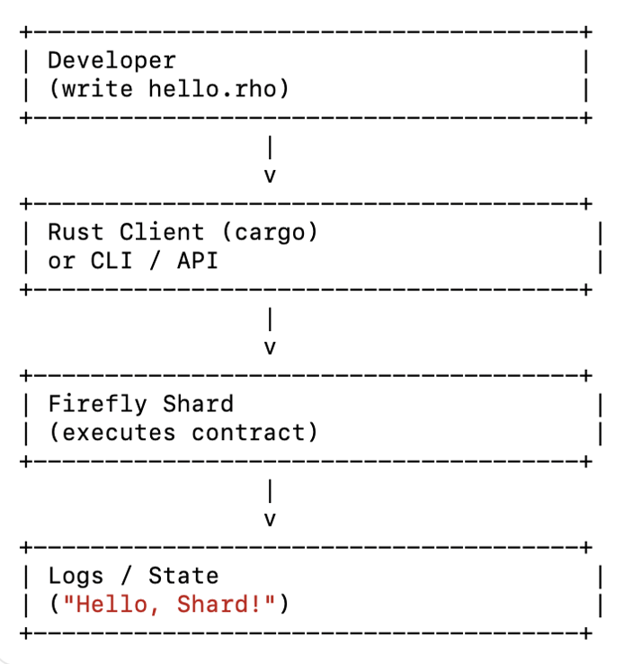
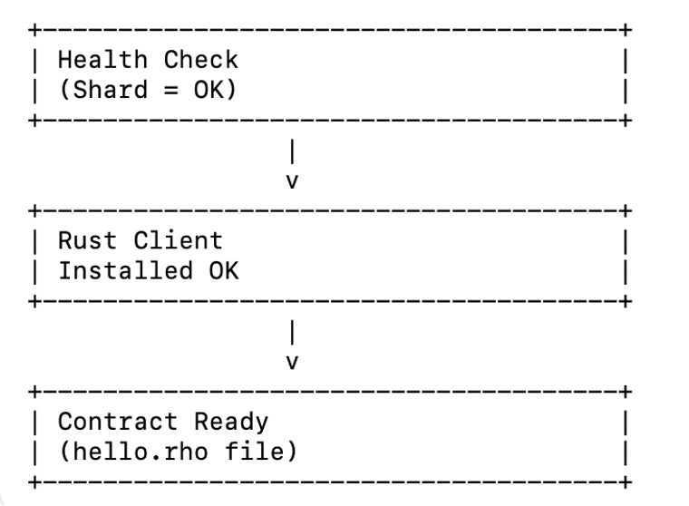
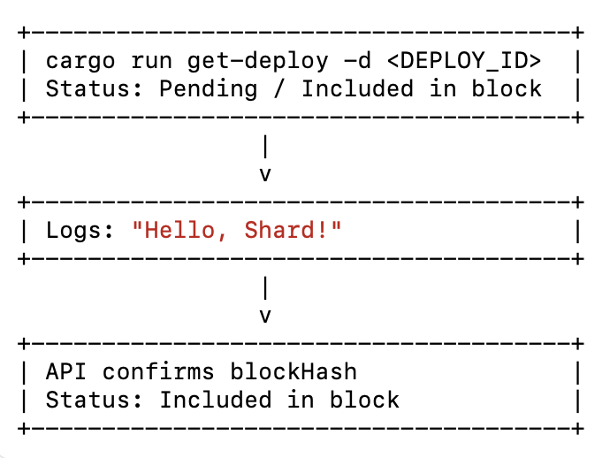
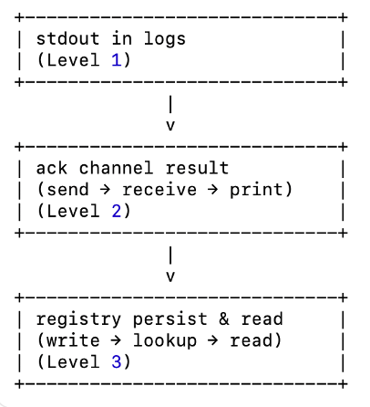
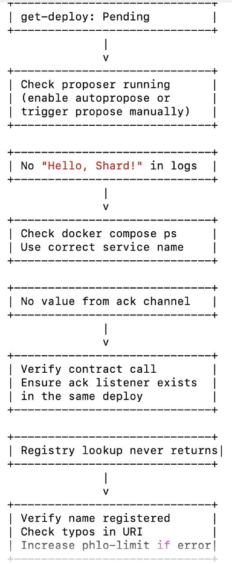
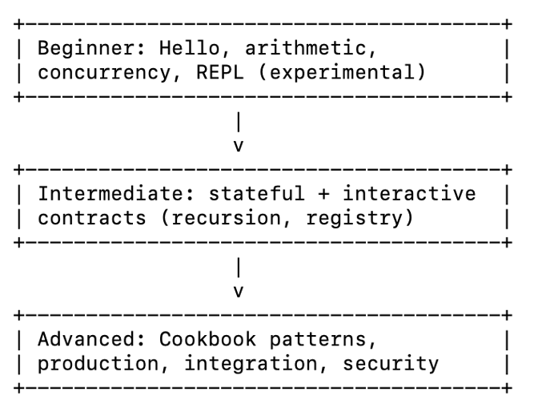
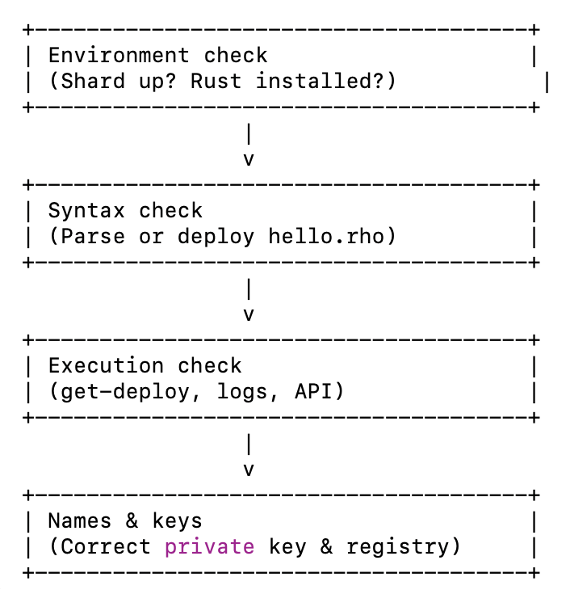

# Part II – How to Deploy Rholang Code to a Shard
> **Document status:** Evidence-based runbook (validated commands + expected outputs).
> **Last verified:** 2026-02-18 • **Repo/branch:** `<REPO>` @ `<BRANCH_OR_COMMIT>`
> **Prepared by:** Daria Bohdanova — Documentation Architect / Technical Writer
> **Validated & approved by:** `<VALIDATOR_NAME>` — `<ROLE>` • **Evidence:** terminal output + logs (+ screenshots where marked)

> **📝 NOTE**
> Parts of the deploy toolchain are currently **DEV-CHECK** gated (`repo/Dockerfile-level blocker`). Verified steps are documented; anything dependent on the canonical deploy CLI/image stays explicitly marked until confirmed on a clean machine.
> 
## Preface
**[Part I - Launching a Firefly Shard**](./part-01-launching-a-firefly-shard-system-integration.md)— ** gets your shard running. You start the node set, confirm the containers stay healthy, and verify the shard responds consistently (for example via /status and clean “Running state” markers in logs).

**Part II** is the next step: taking a running shard and deploying real Rholang code to it. This chapter is an evidence-first runbook: every workflow is presented as copy-pasteable commands with explicit success criteria, so you can validate each step on a clean machine and reproduce the same results reliably.

This chapter follows Firefly’s “onion model”:
- **TL;DR** for experts — minimal steps from “contract” to “observable result”.
- **Standard walkthrough** — explained workflow, guardrails, and verification points.
- **Deep dive** — stateful patterns, registry usage, and secure practices (only where supported and verifiable in this setup).

**Prerequisite:** you must have a shard already running locally (following the steps outlined in [Part I](./part-01-launching-a-firefly-shard-system-integration.md)), and you must be able to hit the status endpoint before attempting any deploy workflow. If the shard is not healthy yet, return to [Part I](./part-01-launching-a-firefly-shard-system-integration.md), complete the readiness checks, and only then continue here.


## TL;DR QuickStart (Part II) — Deploying Rholang to a Local Shard
This is the shortest reproducible path from running shard → deploy → Included in block → stdout visible in logs.
### 0. Preconditions (Shard is up + converged)
Command
```bash
docker ps --format "table {{.Names}}\t{{.Status}}" | egrep "rnode\." || true
```
Expected
- 5 containers: `rnode.bootstrap`, `rnode.validator1`, `rnode.validator2`, `rnode.validator3`, `rnode.readonly`
- all are Up (healthy) (or health: starting for the first ~minute)

Command
```bash
curl -s http://localhost:40413/status && echo
```
Expected
- valid JSON
- "nodes" eventually stabilizes (it may be <5 right after startup; re-check after ~10–30s)

Command (port sanity: HTTP vs gRPC)
```bash
docker port rnode.validator1 | sort
```
Expected (shape)
- `40403/tcp -> ...:40413`  (**HTTP** `/status`)
- `40402/tcp -> ...:40412`  (**gRPC** deploy endpoint for Rust client)

>**📝 NOTE** (40413 vs 40412)
>- 40413 = HTTP status API (`curl .../status)`
>- 40412 = gRPC deploy API (Rust client `deploy --port 40412`)

### 1. Prepare the contract (stdout example)

You can reuse an existing example, or create your own “Hello, Shard!” file.

**Option A — use an existing example**
```bash
cd ~/Documents/GitHub/rust-client
sed -n '1,80p' rho_examples/stdout.rho
```
**Option B — create a minimal hello contract**
```bash
cd ~/Documents/GitHub/rust-client

cat > rho_examples/hello_shard.rho <<'RHO'
new stdout(`rho:io:stdout`) in {
  stdout!("Hello, Shard!")
}
RHO

sed -n '1,20p' rho_examples/hello_shard.rho
```
### 2. Deploy (Rust client → gRPC port)

Command
```bash
cd ~/Documents/GitHub/rust-client
cargo run --release -- deploy --host localhost --port 40412 --file ./rho_examples/hello_shard.rho
```
Expected (PASS)
✅ Deployment successful!
🆔 Deploy ID: <...>

>**⚠️ Guardrail**
Only run get-deploy if the deploy command printed a real Deploy ID.


### 3. Verify deploy inclusion (“Included in block”)
Command
```bash
cd ~/Documents/GitHub/rust-client
DEPLOY_ID="PASTE_DEPLOY_ID_HERE"
cargo run --release -- get-deploy -d "$DEPLOY_ID"
```
Expected
- ✅ Status: Included in block
- a Block Hash: ...

>**📝 NOTE**
get-deploy connects to the node’s HTTP endpoint (you will typically see it connect to localhost:40413). That’s expected in this workflow.

If you see Pending, re-run the same command a few times — the shard will include it shortly once block production progresses.

### 4. Observe stdout in logs (execution evidence)

Command (single validator)
```bash
docker logs --since 30m rnode.validator1 | egrep -i "Hello, Shard|rho:io:stdout|stdout" || true
```
Expected
- a Received DeployData ... line containing your deployed code
- the actual printed output:
  - "Hello, Shard!"

Optional (check all validators quickly)
```bash
for c in rnode.validator1 rnode.validator2 rnode.validator3; do
  echo "=== $c ==="
  docker logs --since 30m "$c" | egrep -i "Hello, Shard|rho:io:stdout|stdout" || true
done
```
### Troubleshooting Notes (only if something breaks)

#### A) Could not deploy, casper instance was not available yet
This usually means the shard is not ready to accept deploys yet (even if /status responds). In practice:
- It often happens in the first minutes after startup, or
- when genesis/config inputs aren’t fully present/consistent inside /var/lib/rnode/....

What to do
1.	Wait a bit (until block height is no longer 0) and retry deploy.
2.	Confirm Casper is progressing by checking the current block number in deploy output (it should move above 0 once ready).
3.	If it persists, do a clean reset and re-launch the shard following [Part I](./part-01-launching-a-firefly-shard-system-integration.md) (macOS workaround included), then retry **Part II TL;DR.**

#### B) h2 protocol error: http2 error
You’re pointing the Rust client at the HTTP port instead of gRPC.

Fix
- deploy must use `--port 40412' (gRPC)
- `/status` must use ':40413' (HTTP)

#### C) poetry run shardctl ... fails with “pyproject.toml not found”
You’re in the wrong directory.
Fix
```bash
cd ~/Documents/GitHub/system-integration
poetry run shardctl status
```
## Introduction

You have a Firefly shard running locally — containers are healthy, `/status` responds, and the node set converges. That was [Part I](./part-01-launching-a-firefly-shard-system-integration.md) (the canonical **system-integration + shardctl** workflow).

**Part II** is where the shard stops being “just infrastructure” and starts doing useful work: you deploy Rholang code, verify it was accepted and included in a block, and observe the result (usually via node logs).

Rholang is Firefly’s smart contract language. If you’ve used other chains, you can think of it as the “contract layer” (like Solidity or Move), but with a different mental model: concurrency and message passing. In practice, you write processes that communicate through channels — many small workers running in parallel, not one long sequential script.

### Why deploy a Rholang contract?

A shard that only answers `/status` is “alive”, but it’s not yet proving execution. Deploying contracts lets you:

- **prove execution** (the shard can accept a deploy and reduce it),
- **validate the full toolchain** (client → node API → block inclusion → observable effect),
- **start real workflows** (state, interactions, and repeatable dev loops).

### What you’ll do in Part II

We move from **“running shard” → “deploy” → “included in block” → “observable result”**, with copy–paste commands and explicit pass criteria:

1. **Prerequisites** — shard readiness + correct ports (HTTP vs gRPC) + Rust client.
2. **Prepare a minimal contract** — “Hello, Shard!” (`stdout` example).
3. **Deploy (canonical)** — Rust client over gRPC (host `:40412` on the default system-integration mapping).
4. **Verify inclusion** — `get-deploy` returns “Included in block”.
5. **Observe results** — confirm output in logs (`docker logs rnode.validator* ...`).
6. **Troubleshooting** — predictable failure modes (e.g., Casper not ready yet) and what to collect.

### The big picture (deployment flow)

See the deployment flow diagram: [Rholang Deployment Flow (Part 2)](./images/p2-rholang-deploy-flow.png)



*Diagram — illustration only, not executable code.*

>**👉 NEXT**
**§2 Prerequisites** — making sure your shard, client, and contracts are ready.

## 2. Prerequisites
Before we ask the shard to do real work, let’s make sure the basics are in place. Deploying without prerequisites is like showing up to a camping trip with no tent — technically possible, but you won’t enjoy it.

### 1. A healthy shard ([Part I](./part-01-launching-a-firefly-shard-system-integration.md) completed)
Start your shard using the system-integration workflow from [Part I](./part-01-launching-a-firefly-shard-system-integration.md) (Scala shard is the stable default). This repository is the “home” for running the shard locally. 
Recommended readiness check (canonical):
```bash
cd ~/Documents/GitHub/system-integration
poetry run shardctl wait
```
Quick health check (HTTP status endpoints):
```bash
curl -s http://127.0.0.1:40403/status && echo   # bootstrap
curl -s http://127.0.0.1:40413/status && echo   # validator1
curl -s http://127.0.0.1:40423/status && echo   # validator2
curl -s http://127.0.0.1:40433/status && echo   # validator3
curl -s http://127.0.0.1:40453/status && echo   # readonly (optional)
```
Expected:
- Each endpoint returns JSON (not empty / not error).
- `peers / nodes` are non-zero.
- In a stable multi-node setup, counts typically match the cluster size, but right after startup they may fluctuate while nodes reconnect.

>**⚠️ WARNING**
If your shard isn’t healthy, stop here and fix that first. The rest of this section will fail in increasingly confusing ways.

### 2. Rust client available (canonical deploy path)
The Rust client is the canonical way to deploy contracts in this guide.  

From the rust-client repo:
```bash
cd ~/Documents/GitHub/rust-client
cargo run --release -- --help
```
Expected: a list of available commands (deploy, get-deploy, status, …).

>**💡 TIP**
If you see cargo: command not found, Rust isn’t installed or your PATH isn’t set up. Install Rust via rustup and reopen your terminal.

### 3. A contract file to deploy (stdout “Hello, Shard!”)
Use a known-good example contract from either repo:
- `f1r3node: rholang/examples/stdout.rho`
- `rust-client: rho_examples/stdout.rho`

Minimal stdout contract:
```rholang
new stdout(`rho:io:stdout`) in {
  stdout!("Hello, Shard!")
}
```
### 4. Ports (avoid the 40413 vs 40412 trap)
- **40413** = HTTP status API (what you curl)
- **40412** = gRPC API (what the Rust client uses for deploy)

Confirm port mappings anytime:
```bash
docker port rnode.validator1 | sort
```
### 5. Sanity checks before moving on
If all three checks pass, you’re ready to deploy:
1.	Shard health is OK (status endpoints respond, peers/nodes non-zero)
2.	Rust client works (`cargo run --release -- --help`)
3.	Contract file exists (`stdout.rho`)


*Diagram — illustration only, not executable code.*

This diagram summarizes the flow described above.

>**👉 NEXT**
**§3 Preparing Your Contract** — we’ll take stdout.rho and get it ready for deployment.

## 3. Preparing Your Contract

Before deploying, you need something to deploy. In Firefly, that “something” is a Rholang contract — a `.rho` file executed by the shard.

In this guide, the canonical deploy path is the Rust client. A Scala client exists, but it is advanced / research-only and is not used for the baseline workflow.

### Level 1: Quick Path (“Hello, Shard!”)

We’ll start with the simplest possible contract: print a line to stdout.

**Option A (recommended):** use the known-good example from rust-client
```bash
cd ~/Documents/GitHub/rust-client
sed -n '1,80p' rho_examples/stdout.rho
```
Expected contents:
```rholang
new stdout(`rho:io:stdout`) in {
  stdout!("hello, world!")
}
```
**Option B:** keep the same example in f1r3node (if you prefer contracts near the node repo)
- `f1r3node: rholang/examples/stdout.rho`
- `rust-client: rho_examples/stdout.rho`

What this contract does

- new stdout(`\rho:io:stdout`)` creates access to the standard output channel.
- `stdout!(...)` prints the string into node logs when the deploy is executed.

When deployed successfully, you will see:
`"hello, world!"` in validator logs.
>**TIP**
You can store contracts anywhere — the Rust client deploys whatever path you pass with `--file.`

### Level 2: One more tiny example (Echo)

This example shows the two core Rholang operations: send and receive.

Create a new file (any location is fine; here we keep it in rust-client for convenience):
```bash
cd ~/Documents/GitHub/rust-client
cat > /tmp/echo.rho <<'RHO'
new echo, stdout(`rho:io:stdout`) in {
  for(@msg <- echo) {
    stdout!(msg)
  } |
  echo!("Hello again!")
}
RHO
```
Expected output in logs:
`"Hello again!"`
>**DEEP DIVE**
In Rholang, sending `chan!(x)` and receiving `for(@x <- chan)` are fundamental. When a matching send/receive pair meets on the same channel, the system performs a reduction (a basic computation step).

Where to look for output (logs)

Since [Part I](./part-01-launching-a-firefly-shard-system-integration.md)  runs the shard via **system-integration**, your nodes run as Docker containers (`rnode.validator1, etc.).` For stdout contracts, checking validator logs is the simplest.

Example (search validator1 logs):
```bash
docker logs --since 10m rnode.validator1 | egrep -i "rho:io:stdout|hello, world|Hello again" || true
```
You can also check other validators:
```bash
for c in rnode.validator1 rnode.validator2 rnode.validator3; do
  echo "=== $c ==="
  docker logs --since 10m "$c" | egrep -i "rho:io:stdout|hello, world|Hello again" || true
done
```
#### Pre-deploy checklist

Before moving to deployment methods, make sure:
1.	Shard is healthy [Part I](./part-01-launching-a-firefly-shard-system-integration.md)
```bash
cd ~/Documents/GitHub/system-integration
poetry run shardctl wait || true
curl -s http://127.0.0.1:40413/status | tr ',' '\n' | egrep '"peers"|"nodes"' || true
```
>**NOTE:** If peers / nodes temporarily show 0, wait **10–30 seconds** and re-run the command (this can happen during brief restarts/reconnects). For deployment, the key requirement is that validator1’s **gRPC port 40412** is reachable.

2.	Rust client is available
```bash
cd ~/Documents/GitHub/rust-client
cargo run --release -- --help | head
```
3.	You are using the correct ports

- 40413 = HTTP status API (curl /status)
- 40412 = gRPC API (Rust client deploy)

Confirm mapping anytime:
```bash
docker port rnode.validator1 | sort
```
If all three pass — you’re ready to deploy.

>**👉 NEXT**
**§4 Deployment Methods** — sending your contract to the shard (Rust client → gRPC port 40412).


## 4. Deployment Methods

This section shows the canonical (“hero path”) way to deploy Rholang contracts to a local Firefly shard.

**Source of truth (local run)**: `system-integration + shardctl` (Scala node, Shard topology).
**Deployment client: rust-client** (canonical for this guide).
**Ports (validator1 default mapping):**
- **40412** — gRPC (used for deploy)
- **40413** — HTTP status / REST (used by some status checks; can be flaky)

**Important:** start the shard first (fresh terminal / rebooted machine)
Before running any deploy commands, bring the local shard up via shardctl and choose:
1) Scala (stable)
2) Shard topology

**Verification note:** In local runs, prefer **§5 (Logs = canonical)** for inclusion/execution proof; HTTP/WebSocket checks are best-effort.

### Level 1 — Canonical deploy (Rust client → gRPC)

#### 1) Start the shard (system-integration)
Run from a clean terminal:
```bash
cd ~/Documents/GitHub/system-integration

# Stop any existing local shard (ok if nothing is running)
poetry run shardctl down f1r3node || true

# Start the shard (interactive)
poetry run shardctl up f1r3node
```
When shardctl prompts you, choose exactly:
- Select node implementation: **enter 1 → Scala (stable)**
- Select network topology: **enter 2 → Shard topology (bootstrap + validators + readonly)**

Then wait until all nodes are ready:
```bash
poetry run shardctl wait || true
```
You should see something like “All 5 node(s) ready”.

#### 2) Confirm validator1 port mapping (optional but recommended)
This proves which ports are actually exposed on your machine:
```bash
docker port rnode.validator1 | sort
```
Expected: `40402/tcp -> ...:40412 (gRPC) and 40403/tcp -> ...:40413 (HTTP).`

#### 3) (Optional) Quick health check (HTTP)
```bash
curl -sS http://127.0.0.1:40413/status && echo
```
Expected: JSON response. peers/nodes should be non-zero once the shard connects.

#### 4) Deploy the sample contract (rust-client)
```bash
cd ~/Documents/GitHub/rust-client
cargo run --release -- deploy \
  --host localhost --port 40412 \
  --file rho_examples/stdout.rho
  ```
Expected:
- Deployment successful!
- A printed Deploy ID (save it)

**Where Deploy ID comes from**
It is printed by rust-client after the node accepts the deploy over gRPC.


### Level 2 — Verification (reliable path = logs)

Because HTTP status queries can flap, the canonical verification for local docs is:
1.	Deploy reached the node
2.	The shard produced a block (heartbeat)
3.	The contract executed (stdout output)

#### 1) Verify deploy reached validator1 (deploy accepted)

```bash
docker logs --since 15m rnode.validator1 \
  | egrep -n 'Received DeployData|rho:io:stdout' \
  | tail -n 200
  ```
Expected: a line like `Received DeployData ...` and/or a snippet containing `rho:io:stdout.`

#### 2) Verify the shard produced a block (heartbeat-driven)
```bash
docker logs --since 15m rnode.validator1 \
  | egrep -n 'Heartbeat: Proposing block|Creating block|Block created' \
  | tail -n 200
  ```
Expected: Heartbeat: `Proposing block ...`, then `Creating block ...`, then `Block created ....`

#### 3) Verify the contract executed (stdout output)
```bash
docker logs --since 15m rnode.validator1 \
  | egrep -n 'hello, world!' \
  | tail -n 200
  ```
Expected: one or more lines containing `hello, world!.`

What these three checks prove
1. confirms the node accepted your deploy into the deploy pool.
2. confirms the local shard is producing blocks automatically (heartbeat).
3. confirms the deploy executed during block processing (observed output).

### Level 3 — Optional status checks (best effort)

These checks are convenient when they work, but they depend on node HTTP / WebSocket endpoints and may flap during local runs (connection reset / refused). If Level 3 is unstable, treat Level 2 (logs) as the source of truth.

#### 1) Query deploy status by Deploy ID (HTTP, may flap)
Run from `rust-client:`
```bash
cd ~/Documents/GitHub/rust-client
cargo run --release -- get-deploy -d "PASTE_DEPLOY_ID_HERE" || true
```
Expected (when stable): status progresses from Pending → Included in block.

If you see connection reset by peer, connection refused, or it stays Pending while Level 2 logs show "hello, world!":
✅ assume deploy executed; HTTP is flaky; stick to Level 2.
>**NOTE**
Do not wrap the ID in < >. Always pass it as a quoted string.

#### 2) Deploy + wait (convenience wrapper, still uses HTTP for polling)
This command deploys via gRPC and then polls status over HTTP.
```bash
cd ~/Documents/GitHub/rust-client
cargo run --release -- deploy-and-wait \
  --host localhost --port 40412 \
  --http-port 40413 \
  --file rho_examples/stdout.rho \
  --max-wait 120 \
  --check-interval 5 \
  || true
  ```
Expected (when stable): it prints a Deploy ID and eventually reports inclusion/finalization.

If it fails specifically on “checking deploy status” / “network error”: that’s the same HTTP flakiness → verify via **Level 2 logs.**

#### 3) Watch block events (WebSocket, may flap)
This is useful for demos, but WebSocket reconnect loops are normal in unstable local setups.

Created blocks:
```bash
cd ~/Documents/GitHub/rust-client
cargo run --release -- watch-blocks --filter created || true
```
Finalized blocks:
```bash
cd ~/Documents/GitHub/rust-client
cargo run --release -- watch-blocks --filter finalized || true
```
How to stop it
- Foreground process: press Ctrl+C.
- If Ctrl+C doesn’t stop (rare terminal state):
- press Ctrl+\ (hard stop), or
- close the terminal tab, or
- find & kill the process:
```bash
ps aux | egrep "node_cli watch-blocks" | grep -v egrep
kill -9 <PID>
```
### Summary — what to trust

| Goal | Best check (canonical) | Optional check (best-effort) |
|---|---|---|
| Confirm deploy reached node | **Level 2.1**: `Received DeployData` in `rnode.validator1` logs | `get-deploy` (HTTP) |
| Confirm blocks are produced | **Level 2.2**: `Heartbeat… Creating block… Block created…` | `watch-blocks --filter created` |
| Confirm contract executed | **Level 2.3**: `"hello, world!"` in logs | `deploy-and-wait` success output |


### Stop the shard (clean shutdown)
```bash
cd ~/Documents/GitHub/system-integration
poetry run shardctl down f1r3node
```
>**👉 NEXT**
**§5 Verifying Deployment Inclusion** — how to interpret “Pending”, confirm inclusion reliably, and what to do when HTTP status endpoints flap.

## 5. Verifying Deployment Inclusion

Submitting a deploy isn’t the end of the story. You need to confirm the deploy was included in a block and executed by the shard.

In local runs, HTTP status endpoints may flap (connection reset/refused). For that reason, this guide treats logs as the canonical proof of inclusion/execution, and HTTP/WebSocket checks as best-effort convenience only.

For local shards, “included + executed” is confirmed by block-production logs + the expected contract output in rnode.validator1 logs (even if HTTP still shows Pending).

### Level 1 — Quick status check (HTTP, best-effort)

If you captured a Deploy ID, you *can* query status via the Rust client:

```bash
cd ~/Documents/GitHub/rust-client
cargo run --release -- deploy --host localhost --port 40412 --file rho_examples/stdout.rho
```
Expected (when stable): `Pending → Included in block.`

If you see connection reset by `peer, connection refused`, or it stays `Pending`, **do not block on it** — use Level 2 (logs). This is a known limitation of unstable local HTTP.

>**NOTE**
Do not wrap the ID in < >. Always pass it as a quoted string.

### Level 2 — Canonical verification (logs)

This is the most reliable way to verify inclusion and execution in local `system-integration + shardctl runs.`

#### 1) Confirm the shard produced blocks (heartbeat-driven)
```bash
docker logs --since 15m rnode.validator1 \
  | egrep -n 'Heartbeat: Proposing block|Creating block|Block created' \
  | tail -n 200
  ```
You should see:
- `Heartbeat: Proposing block ...`
- `Creating block ...`
- `Block created ...`

#### 2) Confirm the contract executed (stdout output)
```bash
docker logs --since 15m rnode.validator1 \
  | egrep -n '"hello, world!"' \
  | tail -n 120
  ```
If you see `"hello, world!"`, the deploy was executed during block processing.

**What Level 2 proves**
- Block production is working (heartbeat proposer).
- Your deploy executed (stdout output observed in validator logs).
Together, this is a reliable “included + executed” confirmation for local runs.

### Level 3 — Optional convenience checks (best-effort)

These checks are useful when they work, but they depend on HTTP/WebSocket endpoints and may reconnect or fail in local setups.

#### 1) Deploy and wait (still polls HTTP)
```bash
cd ~/Documents/GitHub/rust-client
cargo run --release -- deploy-and-wait \
  --host localhost --port 40412 \
  --http-port 40413 \
  --file rho_examples/stdout.rho \
  --max-wait 120 \
  --check-interval 5 \
  || true
  ```
If it fails on “checking deploy status” / “network error”, use Level 2 logs instead.

#### 2) Watch block events (WebSocket, may reconnect)
```bash
cd ~/Documents/GitHub/rust-client
cargo run --release -- watch-blocks --filter created || true
```
Stop it:
- Ctrl+C (foreground)
- If it gets stuck: Ctrl+\ (hard stop) or close the terminal tab

### Verification checklist (local run)
- Logs show `Block created ...`
- Logs show the expected output (e.g. `"hello, world!"`)
- get-deploy reports Included in block (optional)

If the first two pass, your deploy was executed and included in the local shard’s block flow.

 
 Diagram — illustration only, not executable code
*This diagram summarizes the flow described above.*

>**👉 NEXT**
**§6 Executing and Reading Results** — beyond simple logs: how to observe richer contract behavior and interact with outputs.

## 6. Executing and Reading Results

Deploying is only half the story. Now you need to observe what actually happened and read the contract’s result.

In local `system-integration + shardctl runs`, “results” can surface in three places depending on how your contract is written:
1.	stdout (logs) — quick, human-friendly, but ephemeral
2.	ack (return) channel — “function-like” one-off result returned during the same deploy
3.	registry (persisted state) — durable result you can read later with a second deploy

>**Important:** Node HTTP endpoints return deploy/block metadata (e.g., block hash, costs). They do not return stdout output. For stdout, use container logs.

>**WARNING:** `stdout` output is ephemeral and subject to log rotation. If you need durable results, persist state (registry) or design a query deploy that reads persisted state and prints it.

Execution paths (stdout / ack / registry)

*Diagram — illustration only (shows where “results” appear).*

### Level 1 — Read from logs (stdout)

This is the simplest “read results” method for contracts that print via stdout (e.g., stdout.rho).

#### 1) Deploy a stdout contract (example)
`rho_examples/stdout.rho in rust-client:`
```rholang
new stdout(`rho:io:stdout`) in {
  stdout!("hello, world!")
}
```
Deploy it:
```bash
cd ~/Documents/GitHub/rust-client
cargo run --release -- deploy \
  --host localhost --port 40412 \
  --file rho_examples/stdout.rho
  ```
#### 2) Read stdout output from validator logs (canonical)
```bash
docker logs --since 15m rnode.validator1 \
  | egrep -n '"hello, world!"' \
  | tail -n 120
  ```
If you see `"hello, world!"`, the deploy executed during block processing.

### Level 2 — Return (ack) channel pattern

Use this when you want a function-like result (compute something and return it). The contract creates a fresh channel (ack), passes it into the function, then prints the returned value to stdout (so you can observe it in logs).

#### 1) Create an example contract file (copy-paste)
```bash
cd ~/Documents/GitHub/rust-client

cat > rho_examples/ack_sum.rho <<'RHO'
new ack, sum, stdout(`rho:io:stdout`) in {

  contract sum(@a, @b, ret) = { ret!(a + b) } |

  sum!(2, 3, *ack) |

  for (@x <- ack) {
    stdout!(["ACK_SUM_RESULT", x])
  }
}
RHO
```
#### 2) Deploy it
```bash
cd ~/Documents/GitHub/rust-client
cargo run --release -- deploy \
  --host localhost --port 40412 \
  --file rho_examples/ack_sum.rho
  ```
#### 3) Read the result from logs (validator1)
```bash
docker logs --since 15m rnode.validator1 \
  | egrep -n 'ACK_SUM_RESULT' \
  | tail -n 80
  ```
Expected:
 `["ACK_SUM_RESULT", 5]`

>**Notes:**
- The ack channel is created fresh inside the deploy (new ack ...). No one can guess it.
- This pattern is great for debugging and demos. For durable storage, use Level 3.


### Level 3 — Persist and query state (registry)

Use this when you want results that survive beyond logs. In this guide we show the reproducible part only: inserting a contract/channel into the registry and printing the resulting URI. Registry lookup (reading the URI back) is build-dependent and is intentionally omitted from the canonical local path.

>**Important:** This section assumes your local shard build supports `rho:registry:*` operations.

**Insert a contract into the registry (prints a URI)**
Create file:
```bash
cd ~/Documents/GitHub/rust-client

cat > rho_examples/registry_insert_sum.rho <<'RHO'
new sum,
    ri(`rho:registry:insertArbitrary`), riReturn,
    stdout(`rho:io:stdout`) in {

  contract sum(@a, @b, ret) = { ret!(a + b) } |

  ri!(*sum, *riReturn) |

  for (@uri <- riReturn) {
    stdout!(["REGISTRY_URI", uri])
  }
}
RHO
```
Deploy it:
```bash
cd ~/Documents/GitHub/rust-client
cargo run --release -- deploy \
  --host localhost --port 40412 \
  --file rho_examples/registry_insert_sum.rho
  ```
Read the URI from logs:
```bash
docker logs --since 15m rnode.validator1 \
  | egrep -n 'REGISTRY_URI' \
  | tail -n 20
  ```
Copy the printed URI value.

>**Note:** Registry lookup wiring can differ across local builds. For reproducible local docs, this guide treats Level 1 (stdout) + Level 2 (ack) as canonical. Level 3 is provided as an advanced insertion example (printing a URI) only.


If you see “Computation ran out of phlogistons”, redeploy with bigger phlo:
```bash
cd ~/Documents/GitHub/rust-client
cargo run --release -- deploy \
  --bigger-phlo \
  --host localhost --port 40412 \
  --file rho_examples/registry_insert_sum.rho
  ```
### API / Client observability (complementary)

These are useful, but in local runs they may be unstable.

**Deploy metadata via rust-client (HTTP, may flap)**
```bash
cd ~/Documents/GitHub/rust-client
cargo run --release -- get-deploy -d "PASTE_DEPLOY_ID_HERE" || true
```
If it errors (connection reset/refused), treat logs as source of truth (see §5).

### Troubleshooting Quick Wins

*Diagram — illustration only, not executable code*
| Symptom | Likely cause | Fix |
|---|---|---|
| No stdout output in logs | You’re checking the wrong container | `docker ps` → confirm `rnode.validator1`, then re-run the `docker logs ...` command |
| Deploy succeeds but you don’t see output yet | Block not produced yet | Check heartbeat/block logs (see §5 Level 2.1) and wait a propose cycle |
| Ack pattern prints the code line but not the result | You grepped the wrong thing | Grep the unique marker line: `^\["ACK_SUM_RESULT"` |
| Registry steps don’t work / URI never appears | Registry API differs in your build | Treat registry as advanced; keep Level 1 (stdout) + Level 2 (ack) as canonical for local docs |
| “Computation ran out of phlogistons” | Not enough phlo | Re-deploy with `--bigger-phlo` |

### Execution & results checklist (local run)
- stdout: you can see expected output in `rnode.validator1` logs
- ack: you can return a computed value and print it with a unique marker
- registry: you can persist a reference and (optionally) query it later
- client/API: optional metadata checks (may flap locally)

**👉 NEXT**
**§7 Common Errors & Fixes** — a compact table of issues you’ll hit while deploying and reading results, with one-line fixes and pointers to the exact commands above.

## 7. Common Errors & Fixes

No matter how carefully you deploy, you will hit issues. Don’t panic — most of them are predictable and have simple fixes. Think of this section as your first-aid kit for local Firefly shard runs.

> **🔎 DEEP DIVE**
Rholang execution is reductions — sends and receives meeting on channels.
Most problems come from two buckets:
- **Environment / plumbing**: shard not up, wrong ports, container not running, HTTP flaps.
- **Contract logic**: mismatched sends/receives (e.g., ack send without a listener), wrong patterns, typos in names.

### Level 1 — Quick Wins (Beginner)

| Symptom / Error | Likely cause | Quick fix (copy-paste) |
|---|---|---|
| `Error response from daemon: No such container: rnode.validator1` | Shard is not running (or you are in the wrong Docker context) | Start the shard via system-integration and wait: <br><br>```bash\ncd ~/Documents/GitHub/system-integration\npoetry run shardctl up f1r3node\npoetry run shardctl wait || true\n```\nThen confirm containers exist: <br><br>```bash\ndocker ps --format \"table {{.Names}}\\t{{.Status}}\" | egrep 'rnode\\.' || true\n``` |
| `node not reachable` / gRPC `transport error` | Wrong port, or nodes not ready yet | 1) Wait until shard is ready: <br><br>```bash\ncd ~/Documents/GitHub/system-integration\npoetry run shardctl wait || true\n```\n2) Confirm which ports are mapped on your machine: <br><br>```bash\ndocker port rnode.validator1 | sort\n```\nUse the mapped **gRPC port** when deploying (usually `40412`). |
| `curl .../status` fails with `connection reset by peer` | Known flakiness of local HTTP endpoint | Treat HTTP as best-effort. Verify via logs instead (see Level 3 Execution Check). |
| `No such file or directory` when deploying | Wrong `--file` path or not in `rust-client` repo | Confirm you’re in repo + file exists: <br><br>```bash\ncd ~/Documents/GitHub/rust-client\nls -la rho_examples\n```\nThen deploy with the correct path: <br><br>```bash\ncargo run --release -- deploy --host localhost --port 40412 --file rho_examples/stdout.rho\n``` |
| zsh shows `event not found: \(` or `dquote>` | You pasted a command with unescaped characters / unfinished quotes | Use **single quotes** for `egrep` patterns, and copy-paste full commands as blocks. If you get `dquote>`: press **Ctrl+C** and re-run the command cleanly. Example safe grep: <br><br>```bash\ndocker logs --since 15m rnode.validator1 | egrep -n 'Received DeployData|rho:io:stdout' | tail -n 200\n``` |
| Ctrl+C doesn’t stop `watch-blocks` | Terminal is in a weird state, or the process already exited | First try Ctrl+C, then Ctrl+\\ (hard stop). If still stuck: close the terminal tab. Also check if it’s already gone: <br><br>```bash\nps aux | egrep 'node_cli watch-blocks' | grep -v egrep\n``` |

> **💡 TIP**
If something looks “random” locally, assume it’s either (a) shard not fully ready, (b) you’re reading the wrong container, or (c) HTTP/WebSocket flakiness. Logs are your friend.

### Level 2 — Language & Syntax Errors (Rholang)

| Symptom / Error | Likely cause | Quick fix |
|---|---|---|
| `zsh: parse error near '}'` | You pasted Rholang into the shell | Rholang must live in a `.rho` file. Create a file, then deploy it: <br><br>```bash\ncd ~/Documents/GitHub/rust-client\ncat > rho_examples/example.rho <<'RHO'\nnew stdout(`rho:io:stdout`) in { stdout!(\"ok\") }\nRHO\ncargo run --release -- deploy --host localhost --port 40412 --file rho_examples/example.rho\n``` |
| `Unexpected token }` / syntax errors | Braces/parentheses mismatch | Re-check nesting. Start from known-good examples in `rho_examples/` and modify incrementally. |
| `Unbound variable` | Name used without `new` or contract definition | Bind it explicitly: <br><br>```rholang\nnew stdout(`rho:io:stdout`) in { stdout!(\"hi\") }\n``` |
| “Ack pattern prints code but not the result” | You grepped the code line, not the runtime output | Print a unique marker and grep that marker only (see Level 3). |

### Level 3 — Execution Check (Canonical workflow)

Use this when “deploy succeeded” but you want to confirm it actually executed.

#### 1) Environment check
```bash
cd ~/Documents/GitHub/system-integration
poetry run shardctl wait || true

docker ps --format "table {{.Names}}\t{{.Status}}" | egrep 'rnode\.' || true
```
#### 2) Port check (source of truth)
```bash
docker port rnode.validator1 | sort
```
Use the mapped **gRPC port** (usually 40412) for deploys.

#### 3) Execution check via logs (canonical)
##### A. Confirm blocks are produced
```bash
docker logs --since 15m rnode.validator1 \
  | egrep -n 'Heartbeat: Proposing block|Creating block|Block created' \
  | tail -n 200
  ```
##### B. Confirm stdout output appeared
For `stdout.rho:`
```bash
docker logs --since 15m rnode.validator1 \
  | egrep -n '"hello, world!"' \
  | tail -n 120
  ```
For ack-pattern example (from §6):
```bash
docker logs --since 15m rnode.validator1 \
  | egrep -n '^\["ACK_SUM_RESULT"' \
  | tail -n 120
  ```
>**📝 NOTE**
`get-deploy / deploy-and-wait / watch-blocks` depend on HTTP/WebSocket and may flap locally. If logs show output + block creation, treat that as “executed”.

### Troubleshooting Workflow (Cheat Sheet)
1.	Environment check → shard up? containers running? `shardctl` wait passes?
2.	Port check → confirm actual mapped ports via `docker port rnode.validator1`.
3.	Execution check → prefer logs: heartbeat/block creation + stdout/ACK markers.
4.	Names & keys → only if you are using non-default keys or registry URIs.



Diagram – illustration only, not executable code
*This diagram summarizes the flow described above.*

### Error & Fix Checklist
- Shard is running (containers exist, `shardctl` wait succeeds).
- You deploy to the correct gRPC port (from `docker port`).
- Logs show block creation and expected output (stdout / ACK marker).
- If HTTP/WebSocket flaps: do not block on it; rely on logs.

>**👉 NEXT**
**§8 Next Steps** — where to go once you’ve deployed, verified, and debugged your first contracts: advanced workflows, multi-contract patterns, and security considerations.

## 8. Next Steps

At this point you have a working local shard, can deploy via `rust-client`, and can verify execution reliably via logs (the canonical path in this guide). This section gives you a clean set of “what next” directions that stay consistent with the `system-integration + shardctl` workflow.

### Level 1 — Extend the basics (stdout-first)

Start by iterating on the examples you already ran successfully.

#### 1. Edit the message (quick sanity check):
```rholang
new stdout(`rho:io:stdout`) in {
  stdout!("Custom message here!")
}
```
#### 2.	Try simple arithmetic:
```rholang
new stdout(`rho:io:stdout`) in {
  stdout!(2 + 3 * 4)
}
```
#### 	3.	Play with concurrency:
```rholang
new stdout(`rho:io:stdout`) in {
  stdout!("One") | stdout!("Two") | stdout!("Three")
}
```
Expected: output order may vary (concurrent processes reduce independently).

Deploy exactly the same way as in §4 (Rust client → gRPC), then verify in logs (canonical):
```bash
cd ~/Documents/GitHub/rust-client
cargo run --release -- deploy --host localhost --port 40412 --file <PATH_TO_YOUR_FILE.rho>

docker logs --since 15m rnode.validator1 | tail -n 200
```
### Level 2 — Move to “result patterns” (ack + state)

Once stdout basics are stable, start writing contracts where “results” are observable on purpose.
- Return (ack) channel pattern (single-deploy, function-like results). Use the same style as §6 Level 2: print a unique marker like ["ACK_SUM_RESULT", x] so you can grep for it reliably.
- Stateful contracts (recursion). Introduce stopping conditions early (avoid unbounded log spam), and keep verification log-based.
- Persisted state (registry). Treat registry as advanced / build-dependent in local runs (as described in §6 Level 3). Keep stdout + ack as the canonical reproducible path.

### Level 3 — Towards production workflows (composition + security)

When you start composing multiple contracts, focus on correctness and capability boundaries:
- Prefer unforgeable names (new) to encapsulate sensitive channels.
- Be explicit about who receives which channel (capability-based security).
- Treat all “discoverable” names (registry URIs, hardcoded strings) as public unless protected by design.
- Keep “verification” and “observability” separate:
  - logs show stdout effects,
  - ack channels make results explicit,
  - client/API endpoints provide metadata (and may flap locally).

### Next learning paths
- **Beginner:** stdout-first iteration (sanity deploys, concurrency intuition).
- **Intermediate:** ack-return patterns, recursion/state, multi-step workflows.
- **Advanced: **composition patterns, capability security, integrations/automation.


Diagram – illustration only, not executable code
*This diagram summarizes the flow described above.*

### Checklist before moving on
- You can modify a contract and redeploy it via rust-client (gRPC).
- You can confirm execution via rnode.validator1 logs (canonical).
- You can produce at least one structured result marker (e.g., ACK_SUM_RESULT) and grep it reliably.
- You understand when local HTTP/WebSocket endpoints are best-effort (and when to trust logs instead).

This wraps up **Part II **— Deploying Rholang Code to a Shard. You now have a reproducible workflow to:
- deploy contracts,
- verify inclusion/execution,
- and debug the common failure modes.

### Closing Note 

This guide is designed to be your one-stop resource — practical, complete, and easy to follow. Every step you need to succeed is here in one place.
At the same time, Firefly and Rholang are alive in active repositories. Many of the examples here (contracts, commands, and configs) come directly from those living projects. Exploring them will open up far more patterns, tests, and tools than we could fit in one guide — and will spark your curiosity to go further.
✨ So don’t stop here — keep tinkering, keep experimenting, and let your shard surprise you.


## Appendices
## Appendix A — Rholang Cookbook (Practical Patterns)

This appendix is a copy-paste “recipe book” of small Rholang snippets you can deploy to a **local Firefly shard** using the canonical workflow from this guide: **system-integration + shardctl** to run the shard, and **rust-client** to deploy via **gRPC**.

Canonical local host
On some macOS/Docker setups, --host localhost may cause gRPC transport errors.
For this guide, use **--host 127.0.0.1** as the canonical local host.


### Prerequisites (local shard up)

Run once per session (from a clean terminal):
```bash
cd ~/Documents/GitHub/system-integration

# Stop any existing local shard (ok if nothing is running)
poetry run shardctl down f1r3node || true

# Start shard (interactive)
poetry run shardctl up f1r3node
# choose: 1) Scala (stable), 2) Shard topology

# Wait until nodes are ready
poetry run shardctl wait || true
```
Optional sanity check:
```bash
docker ps --format "table {{.Names}}\t{{.Status}}" | egrep 'rnode\.' || true
docker port rnode.validator1 | sort
```
### Recipe 1 — Hello World (stdout → logs)

Create the contract file:
```bash
cd ~/Documents/GitHub/rust-client

cat > rho_examples/hello_world.rho <<'RHO'
new stdout(`rho:io:stdout`) in {
  stdout!("Hello, Shard!")
}
RHO
```
Deploy:
```bash
cd ~/Documents/GitHub/rust-client
cargo run --release -- deploy --host 127.0.0.1 --port 40412 --file rho_examples/hello_world.rho
```
Verify output (canonical = logs):
```bash
docker logs --since 15m rnode.validator1 | egrep -n '"Hello, Shard!"' | tail -n 60
```
Expected (example):
`"Hello, Shard!"`
### Recipe 2 — Echo (single deploy, self-contained)

This example creates an echo channel, listens on it, and then sends a message.
Because send + receive are both inside the same deploy, it prints immediately when included.

Create the contract file:
```bash
cd ~/Documents/GitHub/rust-client

cat > rho_examples/echo.rho <<'RHO'
new echo, stdout(`rho:io:stdout`) in {
  for (@msg <- echo) { stdout!(msg) } |
  echo!("Ping!")
}
RHO
```
Deploy:
```bash
cd ~/Documents/GitHub/rust-client
cargo run --release -- deploy --host 127.0.0.1 --port 40412 --file rho_examples/echo.rho
```

Verify:
```bash
docker logs --since 15m rnode.validator1 | egrep -n '"Ping!"' | tail -n 60
```
Expected:
`"Ping!"`

### Recipe 3 — Return (ack) Channel Pattern (function-like result)

This is the canonical “return value” pattern for local docs:
- compute something
- return via an ack channel
- print a unique marker so verification is grep-friendly

Create the contract file:
```bash
cd ~/Documents/GitHub/rust-client

cat > rho_examples/ack_sum.rho <<'RHO'
new ack, sum, stdout(`rho:io:stdout`) in {

  contract sum(@a, @b, ret) = { ret!(a + b) } |

  sum!(2, 3, *ack) |

  // Print a unique marker so you can grep reliably
  for (@x <- ack) {
    stdout!(["ACK_SUM_RESULT", x])
  }
}
RHO
```
Deploy:
```bash
cd ~/Documents/GitHub/rust-client
cargo run --release -- deploy --host 127.0.0.1 --port 40412 --file rho_examples/ack_sum.rho
```
Verify:
```bash
docker logs --since 15m rnode.validator1 | egrep -n '^\["ACK_SUM_RESULT"' | tail -n 80
```
Expected:
`["ACK_SUM_RESULT", 5]`

### Recipe 4 — Stateful Counter (stdout, infinite)

This contract prints an increasing sequence forever (use only as a demo).

Create the contract file:
```bash
cd ~/Documents/GitHub/rust-client

cat > rho_examples/counter_infinite.rho <<'RHO'
new counter, stdout(`rho:io:stdout`) in {
  contract counter(@n) = {
    stdout!(n) |
    counter!(n + 1)
  } |
  counter!(0)
}
RHO
```
Deploy:
```bash
cd ~/Documents/GitHub/rust-client
cargo run --release -- deploy --host 127.0.0.1 --port 40412 --file rho_examples/counter_infinite.rho
```
Verify (you should see numbers):
```bash
docker logs --since 15m rnode.validator1 | egrep -n '(^|[^0-9])0([^0-9]|$)|(^|[^0-9])1([^0-9]|$)|(^|[^0-9])2([^0-9]|$)' | tail -n 80
```
>**WARNING**
This runs endlessly and will keep producing log output. Add a stopping condition for any real usage.

### Recipe 5 — Registry Insert (advanced, Step A only)

This is the reproducible part of registry usage for local builds:
- insert a contract/channel into the registry
- print the resulting URI (REGISTRY_URI) to logs

Registry lookup (reading the URI back) is build-dependent and is intentionally omitted from the canonical local path.

Create the contract file:
```bash
cd ~/Documents/GitHub/rust-client

cat > rho_examples/registry_insert_sum.rho <<'RHO'
new sum,
    ri(`rho:registry:insertArbitrary`), riReturn,
    stdout(`rho:io:stdout`) in {

  contract sum(@a, @b, ret) = { ret!(a + b) } |

  ri!(*sum, *riReturn) |

  for (@uri <- riReturn) {
    stdout!(["REGISTRY_URI", uri])
  }
}
RHO
```
Deploy (recommended: bigger phlo):
```bash
cd ~/Documents/GitHub/rust-client
cargo run --release -- deploy --bigger-phlo --host 127.0.0.1 --port 40412 --file rho_examples/registry_insert_sum.rho
```
Verify:
```bash
docker logs --since 15m rnode.validator1 | egrep -n '^\["REGISTRY_URI"' | tail -n 50
```
Expected (example):
`["REGISTRY_URI", `rho:id:...`]`

>**TIP**
If you see Computation ran out of phlogistons, re-deploy with --bigger-phlo (as shown above).

### Clean shutdown (when done)
```bash
cd ~/Documents/GitHub/system-integration
poetry run shardctl down f1r3node
```

## Appendix B — Troubleshooting Cheat Sheet

This appendix is a practical “what to run next” checklist for the most common issues when deploying Rholang to a local shard (bootstrap + 3 validators + readonly).

### Quick Reference: Local Ports (this setup)

**HTTP status endpoints**
- Bootstrap: `http://127.0.0.1:40403/status`
- Validator1: `http://127.0.0.1:40413/status`
- Validator2: `http://127.0.0.1:40423/status`
- Validator3: `http://127.0.0.1:40433/status`
- Readonly:  `http://127.0.0.1:40453/status`

**Rust client deploy (External API)**
- Validator1 External API: `127.0.0.1:40412`

### Environment Issues

#### Shard not reachable
**Symptom**
- `curl .../status` fails (timeout / connection refused), or returns incomplete peer list.

**Checks**
```bash
curl -sS http://127.0.0.1:40403/status | head
curl -sS http://127.0.0.1:40413/status | head
curl -sS http://127.0.0.1:40423/status | head
curl -sS http://127.0.0.1:40433/status | head
curl -sS http://127.0.0.1:40453/status | head
```
**Expected**
- JSON output for each endpoint.
- On validators you should see nodes: 4 and a `peerList` containing bootstrap + validator1/2/3 + readonly.

**Fix**
- Restart the stack and re-check ports / health.
- If containers fail to start with mount errors: verify that the host paths you mount are real files (not directories), e.g. `genesis/bonds.txt, genesis/wallets.txt, monitoring/prometheus.yml.`

#### “Are you trying to mount a directory onto a file?” (Prometheus/genesis mounts)

**Symptom**
- Docker fails during container init with a message like:
“not a directory … Are you trying to mount a directory onto a file…”

**Fix pattern**
1.	Ensure parent directories exist
2.	Remove a wrong “file” path if it accidentally became a directory
3.	Recreate the file

**Example for Prometheus config:**
```bash
mkdir -p monitoring
rm -rf monitoring/prometheus.yml
cat > monitoring/prometheus.yml <<'YAML'
global:
  scrape_interval: 15s
scrape_configs:
  - job_name: 'prometheus'
    static_configs:
      - targets: ['prometheus:9090']
YAML
file monitoring/prometheus.yml
```
**Example for genesis files (validator data dirs):**
```bash
# Ensure these are FILES inside each node data dir
mkdir -p data/rnode.validator1/genesis data/rnode.validator2/genesis data/rnode.validator3/genesis data/rnode.bootstrap/genesis

rm -rf data/rnode.validator1/genesis/bonds.txt   data/rnode.validator1/genesis/wallets.txt
rm -rf data/rnode.validator2/genesis/bonds.txt   data/rnode.validator2/genesis/wallets.txt
rm -rf data/rnode.validator3/genesis/bonds.txt   data/rnode.validator3/genesis/wallets.txt
rm -rf data/rnode.bootstrap/genesis/bonds.txt    data/rnode.bootstrap/genesis/wallets.txt

cp -f genesis/bonds.txt   data/rnode.validator1/genesis/bonds.txt
cp -f genesis/bonds.txt   data/rnode.validator2/genesis/bonds.txt
cp -f genesis/bonds.txt   data/rnode.validator3/genesis/bonds.txt
cp -f genesis/bonds.txt   data/rnode.bootstrap/genesis/bonds.txt

cp -f genesis/wallets.txt data/rnode.validator1/genesis/wallets.txt
cp -f genesis/wallets.txt data/rnode.validator2/genesis/wallets.txt
cp -f genesis/wallets.txt data/rnode.validator3/genesis/wallets.txt
cp -f genesis/wallets.txt data/rnode.bootstrap/genesis/wallets.txt

file data/rnode.validator3/genesis/bonds.txt
file data/rnode.validator3/genesis/wallets.txt
```
### Syntax Issues (Rholang)

#### “Unbound variable”
**Cause**
- A name used without being declared via new.
**Fix**
- Add new x` in { ... } and ensure it is in scope for for / match.

#### “Unexpected token”
**Cause**
- Mismatched braces/parentheses, missing in, or incorrect match syntax.
**Fix**
- Reformat and verify braces; simplify the contract to a minimal version and reintroduce changes incrementally.

#### “Match error”
**Cause**
- Pattern doesn’t match the message shape on the channel.
**Fix**
- Align your for(@{...} <- ch) / match pattern with the value you actually send (especially tuples / lists).

### Execution Issues
#### Status stays Pending / deploy never lands in a block
**Symptoms**
- Rust client returns a deploy id, but nothing changes.
- No Received DeployData in logs.
- No new blocks.
**Checks**
1.	Confirm blocks are being produced:
```bash
docker logs --since 5m rnode.validator1 \
  | egrep -n 'Propose finished: ProposeSuccess|Block created' \
  | tail -n 80
```
2.	Confirm the deploy hit the node:
```bash
docker logs --since 5m rnode.validator1 \
  | egrep -n 'Received DeployData|ERROR|OutOfPhlogistons|Exception' \
  | tail -n 120
  ```
**Fix**
- Ensure proposer is running (autopropose/heartbeat proposer enabled).
- Ensure you are deploying to the correct External API port (Validator1: 40412 in this setup).

#### OutOfPhlogistons
**Symptom**
- Deploy is rejected or fails to execute due to insufficient phlo limit.
**Fix**
- Re-run deploy with a higher phlo limit (depending on your CLI options).
- Keep “hello / ack_sum” examples small; use “bigger-phlo” only when needed.

#### Confirming the contract actually executed (stdout-based)
**Use case**
- Quick end-to-end verification without registry lookups.
**Deploy**
```bash
cd ~/Documents/GitHub/rust-client
cargo run --release -- deploy --host 127.0.0.1 --port 40412 --file rho_examples/ack_sum.rho
```
**Expected in logs**
```bash
docker logs --since 5m rnode.validator1 \
  | egrep -n 'ACK_SUM_RESULT|rho:io:stdout' \
  | tail -n 120
  ```
You should see lines like:
- `stdout!(["ACK_SUM_RESULT", x])`
- `["ACK_SUM_RESULT", 5]`
### Names & Keys

#### Invalid signature / wrong key
**Symptom**
- Signature/authorization errors in client or node logs.
**Fix**
- Verify you’re using the correct private key source for the environment:
- `.env / <PRIVATE_KEY>` (and ensure it matches the node you think you’re deploying as).

#### Troubleshooting Flow


Diagram – illustration only, not executable code
*This diagram summarizes the flow described above.*


## Appendix C – Advanced Concepts (Deep Dive)

These concepts are not required to run the examples in Part I–II, but they explain *why* the system behaves the way it does and help you design contracts that are robust under concurrency, replay, and network delays.

Reductions (What “Execution” Means in Rholang)
In Rholang, computation happens through **reductions:** a send meets a matching receive (or for) on the same channel with the right message shape.

**Practical signal in this guide: **after you deploy ack_sum.rho, the node logs show the deploy being received and reduced, and you can observe stdout output (`via rho:io:stdout`) in the validator logs.

**Unforgeable Names (Secure Channels)**
Names created with new are unforgeable: they cannot be guessed. Only processes that already hold the name can use it. This is a core safety property of Rholang.

**Practical implication:** passing a new-created name is equivalent to granting a capability. If you never share it, nobody else can interact with that channel.

**Capabilities (Access Control by Passing Names)**
Rholang does not rely on global variables for access control. Instead, access is managed by capabilities: if you have the name, you can act; if you don’t, you can’t.

**Practical implication:** most “permissions” in contract design are implemented by deciding which names get passed to whom.

**Concurrency Model (Non-Deterministic Interleavings)**
Rholang processes run concurrently. When multiple reductions are possible, their relative ordering can vary between runs.

What you will see in practice:
- log lines may interleave differently
- stdout lines can appear in different places relative to block-proposal logs
- the chain continues proposing blocks even when your deploy is not immediately included

This is expected behavior and is one reason why contract logic should not rely on log ordering.

**Validity Window (Why the Client Uses “Current block: X … X+50”)**
Deploys are accepted with a **validity window** (in your client output: “blocks X to X+50”). This prevents very old deploys from being included unexpectedly and keeps the mempool consistent.

**Practical implication:**
- if the shard is far ahead, a deploy computed with a stale block number may expire
- if you see deploys not being selected, check validity window and whether the node is actively producing blocks

**Phlogiston (Execution Cost Budget)**
Each deploy carries a phlo (gas) limit. If the contract needs more than the limit, execution fails with OutOfPhlogistons.

**Practical implication:**
- small examples (like ack_sum.rho) work with a small default phlo limit
- larger examples may need a higher phlo limit (your CLI supports --bigger-phlo)

>**📝 NOTE**
You don’t need these deep details to run contracts in Part I–II, but they’re critical for designing secure, concurrency-safe applications.

## Appendix D (Internal) — Pre-publication checklist

This guide is runnable end-to-end with the current tooling (system-integration + rust-client). The items below should be confirmed by the Firefly/Rholang team so the guide documents **supported** and **canonical** behavior (and doesn’t lock in outdated assumptions).

### 1. Query API (Read contract state)

**Question:** What is the *official*, supported way to read contract state/results?
- Is the recommended approach: **registry lookups + explicit “get/return” patterns** inside contracts?
- Is there a supported **HTTP query endpoint** (beyond /status) for reading results/state?
- If logs are “temporary truth”: what is the intended replacement?

**What we do in Part 2 today:** we validate execution via stdout output in node logs (e.g., ACK_SUM_RESULT) and use HTTP /status only for connectivity checks.

### 2. REPL / Playground (Developer UX)

**Question:** Is an official REPL or hosted playground planned (and what scope/support level)?
- local REPL vs hosted sandbox
- version alignment guarantees (node ↔ tooling ↔ examples)

**What we do in Part 2 today:** we test by deploying small `.rho files` through `rust-client` and verifying results via logs, not via a REPL.

### 3. Registry best practices (Canonical patterns)

**Question:** Which registry patterns should be documented as canonical?
- how to register + return URI
- URI versioning strategy (immutable vs overwrite)
- naming conventions, collisions, cleanup strategy

**What we do in Part 2 today:** we keep examples simple and avoid claiming “best” patterns unless the team confirms a canonical approach.

### 4. Contract limits (Size, cost, and validity window)

**Question:** What are the current supported limits and recommended phrasing?
- max deploy size / recommended sizes
- phlo expectations for small vs large contracts
- validity window policy: is a 50-block window canonical/recommended/configurable?

**What we do in Part 2 today:** rust-client auto-sets a 50-block validity window (e.g., “blocks 205 to 255”) and we use a small phlo limit for small demos (e.g., 50,000).

### 5. Future tooling & supported surfaces

**Question:** Which interfaces are considered stable and supported going forward?
- rust-client CLI surface (`deploy, status, get-deploy,` etc.)
- HTTP API surface (and whether OpenAPI on the boot node is canonical)
- advanced methods (Scala node, IaC/custom orchestration): supported vs research-only

**What we do in Part 1/2 today:** we run the network with docker compose from `system-integration `(services: `boot, validator1-3, readonly`) and interact via `HTTP /status` plus rust-client deploys to validator1 external API port `(127.0.0.1:40412).`

>**💡 TIP**
Use this appendix as an “alignment checklist”: once the team answers these, we can lock wording and avoid future “stale tails” in the documentation.

## Appendix E – Sources & Further Reading

This guide is designed to be practical and self-contained — you can follow all steps here without referring to other documents.

That said, Firefly/Rholang live in active repos, and many “ground truth” examples (contracts, commands, configs) come directly from there. If you want more patterns, edge cases, and real-world tooling — these are the best starting points.

### Rholang Examples & Corpus
**Repository:** https://github.com/F1R3FLY-io/f1r3node
**Where to look:** `rholang/examples/` 
**What you’ll find:** a broad collection of `.rho` contracts used in examples and tests (stdout, registry patterns, counters, tokens, error cases, tutorials).
**Useful for:** “cookbook” contracts + learning by reading real, working code.

### Rust Client (Canonical Deployment Tool)
**Repository:** https://github.com/F1R3FLY-io/rust-client/
**Where to look:** `README.md, CLI help output, src/ ` 
**What you’ll find:** official CLI commands for `deploy, get-deploy, status, exploratory-deploy`, etc.
**Useful for:** verifying exact command syntax and supported flags (and staying aligned with the standard Docker-based local setup).  

### Firefly Node & Docker Configs
**Repository:** https://github.com/F1R3FLY-io/f1r3fly  
**Where to look:** `docker/ `and release notes / tags (to match image versions).  
**What you’ll find:** containerized node configs, environment defaults, service layouts, and operational notes.
**Useful for:** aligning Compose/service names and understanding what’s running inside each container.

### Node HTTP API (OpenAPI spec)
**Endpoint (local dev):** `http://127.0.0.1:<HTTP_PORT>/api/v1/openapi.json`
**Example (your current setup):** `http://127.0.0.1:40403/api/v1/openapi.json`
**Useful for:** discovering supported endpoints and request/response shapes (status, blocks, deploy API, exploratory deploy endpoints, etc.).

>**💡 TIP**
If you like learning from raw repos and tests, these sources are your playground — they show a wider universe of patterns and tooling than any single guide can fit.

>**👉 NEXT Part III — Integrating External Resources into Rholang**
**Part III** describes how Rholang interacts with external tools and services.
It covers the supported integration points, configuration basics, and practical examples of wiring Rholang contracts to external data and infrastructure.
