# Part II – How to Deploy Rholang Code to a Shard
## Preface
This chapter is all about turning a running shard into a useful one in a practical sense. In Part I, you successfully launched Firefly and verified the vitality of your shard. Now, in Part II, you will gain the knowledge and skills to make that shard truly productive by deploying Rholang contracts.
This part is written for three audiences at once:
- **Experts** seek the simplest commands to move from contract to result.
- **Developers** who need to understand the fundamentals of Rholang and how contracts execute.
- **Advanced users** who want to explore stateful contracts, registry usage, and secure patterns.
These layers are designed to follow the “onion model”: you have the flexibility to peel off just what you need, or dive deeper for a more comprehensive understanding. This approach puts you in control of your learning journey.
For deeper dives and original sources, see Appendix E – Sources & Further Reading.

## TL;DR Quick Start – Deploying a Rholang Contract

For experts who want results right away:
*1. Write a contract*
From:
F1r3node repository:https://github.com/F1R3FLY-io/f1r3node/blob/main/rholang/examples/stdout.rho
Or
Rust-client-repository: https://github.com/F1R3FLY-io/rust-client/blob/main/rho_examples/stdout.rho
```bash
new stdout(`rho:io:stdout`) in {
  stdout!("Hello, Shard!")
}
```

*2. Run the Rust client (canonical way) to deploy the contract (from rust-client folder):* 
```bash
cargo run -- deploy --file ./rho_examples/stdout.rho
```

*3. Check status (run from rust-client folder)*
```bash
cargo run -- get-deploy -d <DEPLOY_ID>
```

**Expect** `Status: Included in block`

> **📝 NOTE**   `<DEPLOY_ID> `is provided in the output after you run the deploy command.

 
*4.Read result (logs) (run from f1r3node/docker folder)* 
```bash
docker compose -f shard-with-autopropose.yml logs -f <SERVICE_NAME>
```
>**📝 NOTE**  Here `<SERVICE_NAME>` replaces validator1. To confirm the name, run:
`docker compose -f shard-with-autopropose.yml ps`


**Should print:** `Hello, Shard!`

## Introduction
So you’ve got a Firefly shard up and running (congrats — that was Part I!). It’s like having a powerful computer at your disposal, ready to do something interesting, and now, it’s time to put it to practical use.

In Part 1, you learned how to launch a shard and deploy a simple contract. That’s where Rholang comes in, ready to unleash the full potential of your Firefly shard.

Rholang is a unique programming language designed for Firefly’s smart contracts. If you’ve worked with other blockchain platforms, think of it like Solidity for Ethereum or Move for Aptos — except Rholang is built around concurrency and message-passing, making it a fascinating and powerful tool to work with. In simple terms, instead of one worker handling all tasks sequentially, you have a team of workers who can communicate with each other simultaneously.
### Why Deploy a Rholang Contract?
Running a shard without deploying code is like buying a gaming laptop to use it as a flashlight; while the LED is bright, you’re missing the point.
By deploying contracts:
- You **prove your shard is alive** — not just answering pings, but actually running computations.
- You **test real workflows**, including logic, state updates, and user interactions.
- You u**nlock application development** — everything from demos to production-grade dApps starts here.
### What We’ll Do in This Section
The goal is to go from **"blank shard" → "executing contract"** in clear, incremental steps. Think of it like learning to say "Hello World" in a new programming language — except here it's "Hello Shard."
We'll cover:
1. **Prerequisites:** Ensure your shard is healthy and that you have the right tools.
2. **Preparing your contract:** writing a minimal Rholang file (hello.rho).
3. **Deployment methods:** Rust client (canonical), Scala client (advanced, research only), plus Docker and REPL mode as alternatives.
4. **Verification:** checking that your deploy actually landed on the shard.
5. **Execution and results:** seeing "Hello, Shard!" in the logs or via query.
6. **Troubleshooting:** common mistakes (and how to fix them without tears).
### How Hard Is This, Really?
- If you’re worried — don’t be. Deploying a Rholang contract sounds more exotic than it is.
- If you can run (from rust-client folder)
`cargo run – deploy –file ./rho_examples/stdout.rho`
you’re 80% of the way there.
- If you can check the logs with docker compose 
`docker compose -f shard-with-autopropose.yml logs -f <SERVICE_NAME>`
 you’re at 95%.
>**📝 NOTE** Here  `<SERVICE_NAME>`. To confirm the name, run:
`docker compose -f shard-with-autopropose.yml ps`

- The rest is just knowing where files live and which client is canonical, which client you’re using (Rust or Scala) and when to switch (we’ll flag those spots for you).
### The Big Picture
Deploying Rholang code is the **bridge between infrastructure and application:**
*Part I* taught you how to launch the engine.
*Part II* teaches you how to make the engine actually drive somewhere.
By the end of this section, you’ll have deployed your first Rholang contract, seen it execute, and understood the lifecycle of “developer → client → shard → result.” From there, you can branch out into writing more complex contracts, building workflows, and eventually shipping dApps.
>**🔎 DEEP DIVE**
Rholang is based on the ρ-calculus, a process calculus where everything is modeled as a concurrent process and all communication happens through channels.
**In simpler terms:** imagine many small workers running in parallel and sending messages to each other. That’s the mental model of Rholang — multiple processes talking through channels.


This diagram summarizes the flow described above
*Diagram — illustration only, not executable code*

>**👉 NEXT**
**§2 Prerequisites** — making sure your shard, client, and contracts are ready.
## 2.	Prerequisites
Before we ask our shard to do any real work, let’s make sure we’ve packed the right tools in our backpack. Deploying a contract without prerequisites is like showing up to a camping trip with no tent. (Technically possible, but you won’t like it much.)
You need a healthy shard
Make sure you completed **Part I** and have at least one shard running.
**Quick check: run the health endpoint.**
●	Bootstrap   curl http://127.0.0.1:40403/status
●	Validator1  curl http://127.0.0.1:40413/status
●	Validator2  curl http://127.0.0.1:40423/status
●	Validator3  curl http://127.0.0.1:40433/status
●	Observer (optional) curl http://127.0.0.1:40443/status
**Expected output:**
Each node should provide the similar response if running correctly
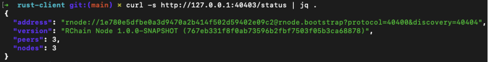

>**⚠️ WARNING**
If your shard isn’t healthy, stop here. Fix that first, or the rest of this section will fail in increasingly mysterious ways.
### Rust client installed
This is the Swiss army knife for deploying contracts. You don’t need to be a Rust guru; you just need the binary.
**Check that you can run from rust-client folder**
```bash
cargo run -- help`
```
**Expected**: a list of available commands `(deploy, get-deploy, status`, …).

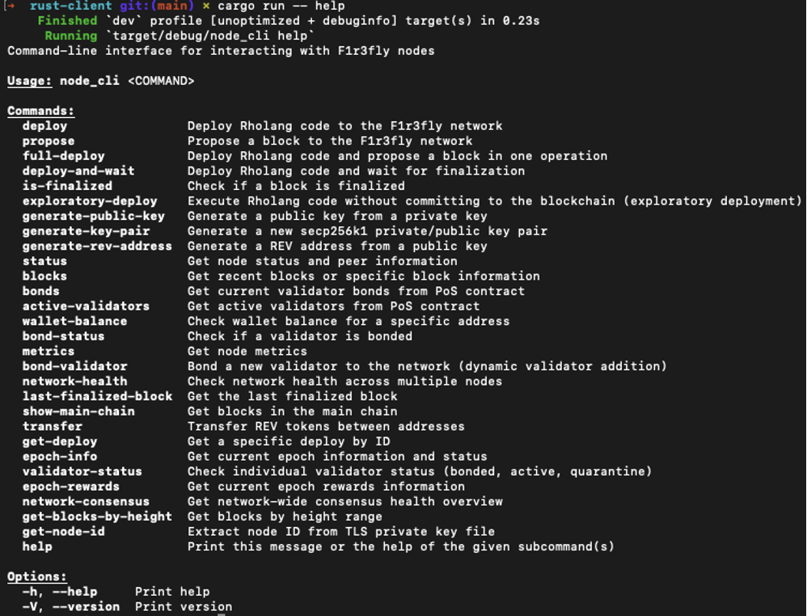

 
>**💡 TIP**
If you see an error like cargo: command not found, it means Rust isn’t installed or your path isn’t set. Go back and install Rust `(rustup)` before moving on.

#### A contract to deploy
You’ll need a Rholang file to send to the shard. The simplest one is a Hello World:
- From F1r3node repository:
https://github.com/F1R3FLY-io/f1r3node/blob/main/rholang/examples/stdout.rho
- Or rust-client repository
https://github.com/F1R3FLY-io/rust-client/blob/main/rho_examples/stdout.rho 
```bash
new stdout(`rho:io:stdout`) in {
  stdout!("Hello, Shard!")
}
```

>**📝 NOTE**
Use one of the confirmed locations for the sample contract:
●	f1r3node: rholang/examples/stdout.rho
●	rust-client: rho_examples/stdout.rho
### Environment and keys
 Set environment variables in your shell to provide your node URL and keys (already set in Part I). For quick testing, set them in your shell; for long-term use, you may keep them in a .env file.
 **Example:**
 `export NODE_URL=http://127.0.0.1:40413`
 `export PRIVATE_KEY=<your_key_here>`
 >**🔒 SECURITY**
 Never paste real keys in documentation or screenshots. Use placeholders like `<PRIVATE_KEY>.`

 >**💡 TIP**
 If you don’t have a dev key yet, use the test key configured in Part I or your team’s standard dev key.
 If your client provides a keygen subcommand (e.g. `cargo run -- keygen`), you may generate a local dev key per team policy.
 
 ### Using environment variables in practice
 Pass flags explicitly run from rust-client folder:
 ```bash
 cargo run -- deploy --file ./rho_examples/stdout.rho --private-key <PRIVATE_KEY> --host localhost --port 40413
 ```

 ###Sanity checks before moving on
 1.	Shard health → Each validator can see other 3 peers  
 ```bash
 {
   "address": "rnode://1e780e5dfbe0a3d9470a2b414f502d59402e09c2@rnode.bootstrap?protocol=40400&discovery=40404",
   "version": "F1r3fly Node 1.0.0-SNAPSHOT (767eb331f8f0ab73596b2fbf7503f05b3ca68878)",
   "peers": 3,
   "nodes": 3
 }
 ```
 >**📝 NOTE**
 Peers count should match the number of other validators in your shard (e.g. 3 if you run 4 nodes)
 
 2.	Rust client → responds to cargo `run -- help`
 3.	Contract file → exists `(stdout.rho)` 
 If all three pass, you’re good to go.
 
 *Diagram — illustration only, not executable co
 This diagram summarizes the flow described above.
 
 >**FUN FACT**
 In Rholang, even simple data types like numbers and strings are modeled as processes. This concurrency-first design is why shards can execute so many operations in parallel without blocking each other.

 >**👉 NEXT**
 **§ 3 Preparing Your Contract** — where we’ll take that stdout.rho file and set it up for deployment.
 
## 3.	Preparing Your Contract
Before deploying, you need something to deploy. In Firefly, that “something” is not just any program — it’s a Rholang contract. This contract is the backbone of your deployment, the key you hand to your shard. A shard, a vital component of the Firefly network, processes the contract and provides results, making the Rholang contract a crucial element in the deployment process.
For deploying contracts, the canonical path is the Rust client. A Scala client exists, but it is advanced/research only; Rust is the baseline we’ll use in all examples.
This section walks you through three levels — from a quick deploy to advanced alternatives — so you can start simple and then go deeper.
 ### Level 1: Quick Path (Hello, Shard!)
The simplest possible contract is the Rholang equivalent of “Hello, World!”
File: `./rho_examples/stdout.rho` (from the rust-client repo)
```bash
new stdout(`rho:io:stdout`) in {
  stdout!("Hello, Shard!")
}
```

- `new stdout` … → creates a channel to standard output.
- `stdout!(…)` → sends the string message to logs.
When you deploy this contract to your shard, you’ll see in logs:
`Hello, Shard!`
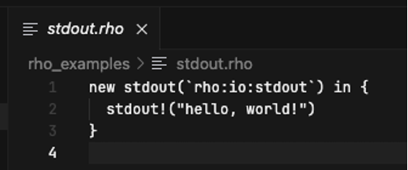

>**💡 TIP**
You can store contracts in any folder, since the path is passed as an argument when deploying.
For clarity, we recommend using rholang/examples/ in the f1r3node repo:
👉 https://github.com/F1R3FLY-io/f1r3node/tree/main/rholang/examples
### Level 2: Understanding Rholang Basics
**Example A: Echo Contract**
```bash
new echo, stdout(`rho:io:stdout`) in {
  for(@msg <- echo) {
    stdout!(msg)
  } |
  echo!("Hello again!")
}
```
●	`new echo` … → defines a fresh channel.
●	`for(@msg <- echo)` → listens for messages on that channel.
●	`stdout!(msg)` → prints what it receives.
●	`echo!("Hello again!")` → sends a message to itself.

**Deploying**
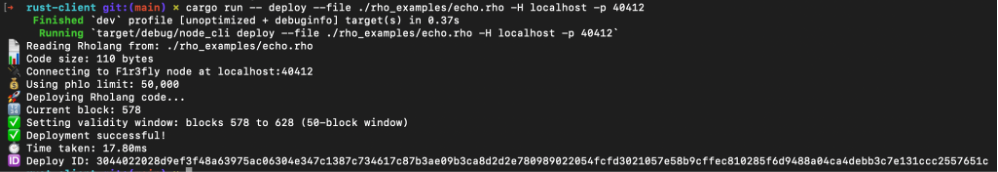

**Expected output in logs:**
`Hello again!`

**Search over all logs:**
```bash
docker compose -f shard-with-autopropose.yml logs validator1 | grep "Hello again"
```
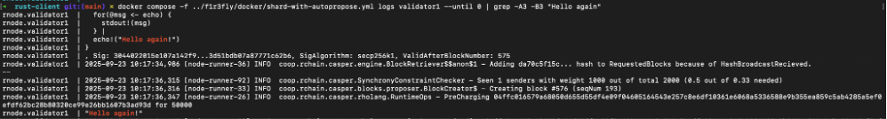

>**🔎 DEEP DIVE**
In Rholang, sending (chan!(x)) and receiving (for`(x <- chan)`) are the two fundamental operations. When a send and a receive meet on the same channel, the system performs a reduction — the basic step of computation.

**Example B: Prime Checker**
```bash
new primeCheck, stdout(`rho:io:stdout`) in {
  contract primeCheck(@n) = {
    match n {
      2 => { stdout!("2 is prime") }
      3 => { stdout!("3 is prime") }
      _ => { stdout!("Check for larger primes...") }
    }
  } |
  primeCheck!(5)
}
```
**Output:**
Check for larger primes...

>**📝 NOTE**
This demonstrates pattern matching in Rholang.
>**🔎 DEEP DIVE**
Fresh channels created with new are called **unforgeable names**. They guarantee secure communication because no other process can guess or forge them.
Think of them as secret phone numbers — only you know them, and nobody else can dial in unless you hand it over.
### Level 3: Advanced Examples
Once you’re comfortable, try exploring advanced patterns. These show how Rholang supports r**egistry lookups, recursion, and stateful processes.**
**Example C: Registry Insert / Lookup**
```bash
new rl(`rho:registry:lookup`), ri(`rho:registry:insertArbitrary`), stdout(`rho:io:stdout`) in {
  new myCh in {
    ri!(*myCh) |
    for(result <- rl!("myContract")) {
      stdout!(["Found contract: ", result])
    }
  }
}
```

>**📝 NOTE**
In practice, lookup expects a URI returned by insertArbitrary. Here "myContract" is used only as a simplified example.

This demonstrates registering and finding names in the **global registry.**

**Example D: Loopback Process**
```bash
new loop, stdout(`rho:io:stdout`) in {
  contract loop(@msg) = {
    stdout!(msg) |
    loop!(msg)
  } |
  loop!("Ping!")
}
```

Deploying this contract makes the shard print Ping! in a loop — until you stop it. A minimal demo of recursion
>**⚠️ WARNING**
Recursive contracts may run indefinitely. Use with caution.

>**📝 NOTE**
These advanced examples are optional and meant for exploration. You don’t need them for the core `“Hello, Shard!”` validation path.
### Pre-Deployment Checklist
Before you move on to deployment:
1.	File created: hello.rho (or another contract).
2.	Syntax valid: make sure your contract has no syntax errors. 
3.	Rust-client does not provide a separate check command, so syntax validation happens automatically when you try to deploy. If there is an error, the deploy will fail immediately.
4.	Expected output understood: you know what the logs should show.
If all checks pass → you’re ready for deployment.
**Example of shard health JSON response:**
```bash
{
  "address": "rnode://1e780e5dfbe0a3d9470a2b414f502d59402e09c2@rnode.bootstrap?protocol=40400&discovery=40404",
  "version": "F1r3fly Node 1.0.0-SNAPSHOT (767eb331f8f0ab73596b2fbf7503f05b3ca68878)",
  "peers": 3,
  "nodes": 3
}
```
>**💡 TIP**
If your team uses another client that has a parser or check subcommand, you can run it before deployment to catch errors faster. For Rust-client users, rely on the deploy step for validation.

>**👉 NEXT**
**§4 Deployment Methods**s — sending your contract to the shard.

## 4.	Deployment Methods

So your contract is ready — nice!  Time to deploy. Think of it like mailing a letter: the contract is your letter, the shard is the mailbox, and the client is your trusty mailman. Drop it in, and it's off.
We’ll explore deployment in three “levels” (like a video game):
- **Level 1** → Quick path with the **Rust client (canonical way — always start here).**
- **Level 2** → Adding flags, parameters, and checking status.
- **Level 3** → Advanced alternatives (Scala Client [research only], Docker Compose).
>**📝 NOTE**
Regardless of the method, what you’re really doing is passing a Rholang process to the shard, which then runs it alongside others — much like multiple conversations happening at the same café table.
👉 Rust client is the default road. Scala and Docker are side paths — valid only in special cases.

### Level 1: Quick Path — Rust Client (Canonical)
The canonical way to deploy a Rholang contract is via the **Rust client.**
**Clone & enter the client repo (once)**
```bash
git clone git@github.com:F1R3FLY-io/rust-client.git  
cd rust-client  
cargo run -- help
```
**Command:**
```bash
cargo run -- deploy --file ./rho_examples/stdout.rho
```
**Expected output:**
📄 Reading Rholang from: ./rho_examples/stdout.rho  
📊 Code size: 62 bytes  
🔌 Connecting to F1r3fly node at localhost:40412 **(default local validator node — <SERVICE_NAME>; confirm with docker compose ps if different)**  
💰 Using phlo limit: 50,000  
🚀 Deploying Rholang code...  
🔢 Current block: 657  
✅ Setting validity window: blocks 657 to 707 (50-block window)  
✅ Deployment successful!  
⏱️  Time taken: 18.40ms  
🆔 Deploy ID: 30440220346d9cec15efdd37d9692fa357bd23815ec9f9eaeb8c0f1ac713d3e41bff00e4022050b5a62c41985ed2833c29f410def5d94becb2145701f93e6e2a3c87717f9d8e
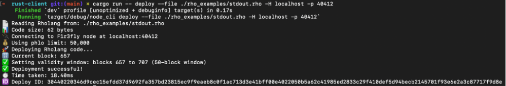

>**📝 NOTE**
This log is simplified for illustration (real runs may include extra lines).
You can place contracts in any folder; for canonical examples, see:
👉 https://github.com/F1R3FLY-io/f1r3node/tree/main/rholang/examples
Pass the correct path to –file if your contract lives elsewhere.

>**💡 TIP**
After deployment, you can immediately check status with:
`cargo run -- get-deploy -d <DEPLOY_ID>`
### Level 2: Intermediate – Parameters and Status
#### Deploy with custom options ( run from rust-client folder)
```bash
cargo run -- deploy \
  --file ./contracts/echo.rho \
  --host localhost --port 40412 \
  --private-key <PRIVATE_KEY>
```

- `--file` → path to your contract.
- `--host` → the shard host.
- `--port`→ the shard port (e.g., 40412 for `<SERVICE_NAME>)`
- `--private-key` → your signing key (never paste real keys in docs; use placeholders).

#### Check your deploy status
After submitting, check the shard to confirm it received your contract ( run from rust-client folder): 
```bash
cargo run -- get-deploy -d <DEPLOY_ID>
```
**Expected output:**
🔍 Looking up deploy: 30440220346d9cec15efdd37d9692fa357bd23815ec9f9eaeb8c0f1ac713d3e41bff00e4022050b5a62c41985ed2833c29f410def5d94becb2145701f93e6e2a3c87717f9d8e
🔌 Connecting to F1r3fly node at localhost:40413
📋 Deploy Information
━━━━━━━━━━━━━━━━━━━━━━━━━━━━━━━━━━━━━━━━
🆔 Deploy ID: 30440220346d9cec15efdd37d9692fa357bd23815ec9f9eaeb8c0f1ac713d3e41bff00e4022050b5a62c41985ed2833c29f410def5d94becb2145701f93e6e2a3c87717f9d8e
✅ Status: Included in block
🧱 Block Hash: 64f734326945a74eb359a2f686e7c517aaf9a60c02cf19c1f21b47a272c9c045
👤 Sender: 04fa70d7be5eb750e0915c0f6d19e7085d18bb1c22d030feb2a877ca2cd226d04438aa819359c56c720142fbc66e9da03a5ab960a3d8b75363a226b7c800f60420
🔢 Sequence Number: 223
🕐 Timestamp: 1758623371280
🌐 Shard ID: root
🔐 Signature Algorithm: secp256k1
⏱️  Query time: 817.05ms

>**⚠️ WARNING**
Status may first appear as “Pending” before changing to “Included in block”.

Example of another deployment with Pending status (see screenshot below).
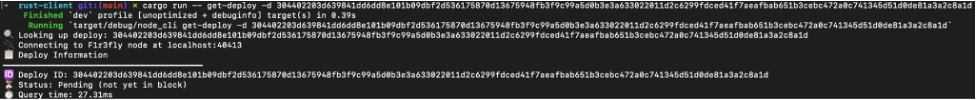

### Level 3: Advanced Alternatives
Not every team will use the Rust client directly. Here are other methods you may encounter:

#### Scala Node (rnode, SBT)

>**⚠️ WARNING**
This method is intended for **Rholang team research only**; it is **not maintained for production use.**

Commands look like   (run from f1r3node folder):
```bash
sbt "node/run deploy  \
  --private-key 61e594124ca6af84a5468d98b34a4f3431ef39c54c6cf07fe6fbf8b079ef64f6 \
  --phlo-limit 10000000 --phlo-price 1 \
  --shard-id root --valid-after-block-number 0 \
  ./rholang/examples/stdout.rho"
```

For details, see Appendix A.
#### Docker Compose
If running the shard in Docker, you can also run deploy commands from inside a container.
Example   (run from f1r3node/docker folder):
```bash
docker compose -f shard-with-autopropose.yml exec <SERVICE_NAME> \
   /opt/docker/bin/rnode \
  --grpc-host 127.0.0.1 --grpc-port 40402 deploy \
  --private-key <PRIVATE_KEY> \
  --phlo-limit 10000000 --phlo-price 1 \
  --shard-id root --valid-after-block-number 0 \
  <PATH_TO_CONTRACT_FILE_INSIDE_CONTAINER>
```

>**📝 NOTE**
Here `<SERVICE_NAME>` replaces validator1. Confirm the actual service name with:
`docker compose -f shard-with-autopropose.yml ps`

>**⚠️ WARNING**
This requires that your contract file (e.g. stdout.rho) is already uploaded into the container. If not, copy it first (e.g. using docker cp) before running the deploy command.

Advanced methods require extra setup. Stick to the Rust client unless you know exactly why you need Docker.
#### ***REPL Mode (Interactive)***
*Instead of deploying a contract and waiting on propose/autopropose, developers may in the future use an interactive REPL session. This mode would allow entering small Rholang snippets line by line and seeing immediate results, which is useful for teaching, debugging, and quick experimentation.
Because the REPL executes code interactively, it removes the wait time for block proposals and gives faster feedback — but it does not persist contracts or provide production-level guarantees. For now, treat this as an exploratory feature suggestion*
>***📝 NOTE**
The REPL is for developer convenience and education. It is not a production or persistence mechanism.*

#### Deployment Methods Overview
Firefly provides multiple ways to deploy Rholang contracts. While all methods achieve the same end goal — sending code to a shard — they serve different purposes and audiences. Rust is the canonical path used in all examples; Scala is provided as an advanced alternative primarily for research.
| Method                                       | Purpose / Use Case                                                                                                   | Audience                           | Status in Guide                                  |
|----------------------------------------------|------------------------------------------------------------------------------------------------------------------------|-------------------------------------|---------------------------------------------------|
| **Rust Client**                              | Canonical method for deploying contracts. Used in dev and production.                                                 | All developers                     | **Main (Level 1 & 2)**                           |
| **Scala Node (rnode, SBT)**                  | Alternative client for research and advanced users. Same deployment semantics as Rust.                                 | Rholang team, advanced users       | Level 3 (Advanced, research-only)                |
| **Docker Compose**                           | Deploy from inside a container for fully containerized shard setups. Requires contract files to be available inside.   | Developers working fully in Docker | Level 3 (Advanced)                               |
| **REPL Mode (Interactive)** *(Pending Dev Confirmation)* | Experimental: interactive execution of Rholang snippets for teaching, debugging, and quick tests. Not persistent. | Developers experimenting with contracts | Level 3 (Exploratory, pending confirmation) |

**Docker specifics** — making contracts available inside the container:

-Recommended: bind-mount a local folder with contracts `(-v /path/to/contracts:/contracts)` and use /contracts/stdout.rho inside the container.
- Alternative: bake the contracts into the image (COPY in Dockerfile).
- Quick test only: copy contracts manually `(docker cp ./stdout.rho <container>:/tmp/stdout.rho)`.
  👉 If your workflow is not fully containerized, stick with the Rust client (Levels 1–2).

>**⚠️ Scala Client WARNING**
This method is intended for Rholang team research and tooling. It is not maintained for production use. Use Rust by default unless your team has standardized on Scala.
**The Scala method is research-only.** Use Rust by default unless your team has standardized on Scala.

### Deployment Checklist
Before moving on:
- Rust client deploy works with your hello.rho.
- You see a deploy ID returned.
- `get-deploy` confirms the status as Included in block.
If all three are true → congratulations, your contract is live on the shard!

>**👉 NEXT**
**§5 Verifying the Deployment** — once your contract is sent, how do you confirm it’s not just “pending,” but actually included in a block (and produced the expected result)?
## 5.	Verifying the Deployment

Submitting a deploy isn’t the end of the story. You need to make sure the contract was not just pending, but included in a block (status: Included in block) and executed by the shard. Otherwise, it’s like sending a letter and never checking if it was delivered.
Verification gives you confidence that your shard is behaving as expected and that your contract has taken part in the global reduction process.
>**🔎 DEEP DIVE**
In Rholang, execution is modeled as a series of reductions. A deploy adds a process to the shard, and verification ensures that this process has indeed reduced together with others, producing the expected result.
### Level 1: Quick Check — Rust Client (Canonical)
After submitting a deploy, the shard returns a deploy ID. Use this ID to check the deploy’s status: 
```bash
cargo run -- get-deploy -d <DEPLOY_ID>
```
**Expected progression:**
```bash
Status: Pending (not yet in block)
...
Status: Included in block
```

- `Pending (not yet in block)` → the contract is in the deploy queue.
●	`Included in block` → the contract has been reduced and committed to a block.
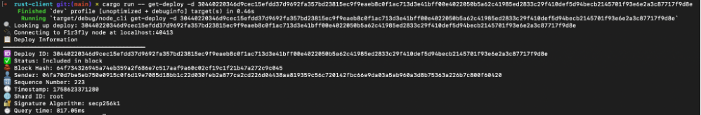
>**📝 NOTE**
Propose cycle: If your Compose profile doesn’t enable automatic proposing, a deploy may remain pending until a block is proposed. Use a profile with autopropose (e.g., `shard-with-autopropose.yml)`. Otherwise, expect a short delay or trigger proposing manually.
### Level 2: Reading the Execution Output (Logs)
For contracts that write to stdout, like hello.rho, the simplest verification is checking the logs. If you’re running the shard in Docker (run from `f1r3node/docker folder)`:
```bash
docker compose -f shard-with-autopropose.yml ps   # check the service name
docker compose -f shard-with-autopropose.yml logs -f <SERVICE_NAME>
```
You should see:
`Hello, Shard!`
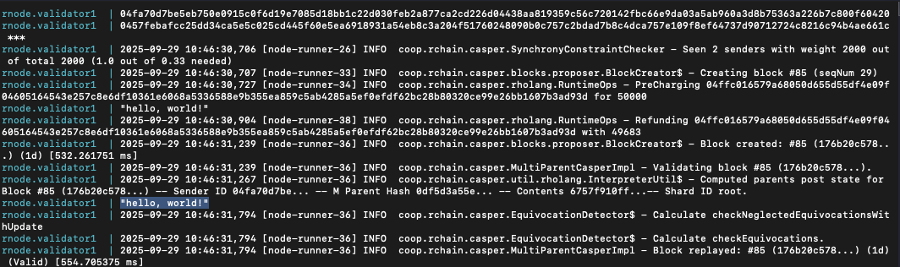

 
>**🔎 DEEP DIVE**
`stdout!(msg)` is just a **send**; when it meets a matching **receive** on `stdout`, the reduction prints the message.

>**⚠️ WARNING**
If you don’t see the expected output, double-check the correct `<SERVICE_NAME>` from docker compose ps and confirm that the contract was deployed to the running shard.

### Level 3: Advanced Verification — Shard API
For automation and monitoring, you can query the shard’s HTTP API directly.
Check a deploy by ID:
```bash
curl http://127.0.0.1:40403/api/deploy/<DEPLOY_ID>
```
Example response:
```bash
{
  "blockHash": "abc123...",
}
```
`blockHash`→ the block where it was included.
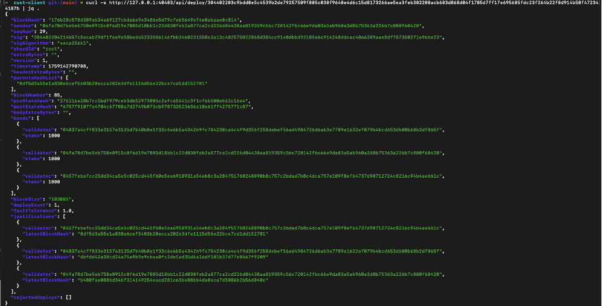
To inspect the block and view additional details (such as execution cost):
```bash 
curl -s http://127.0.0.1:40403/api/block/<BLOCK_HASH>
```
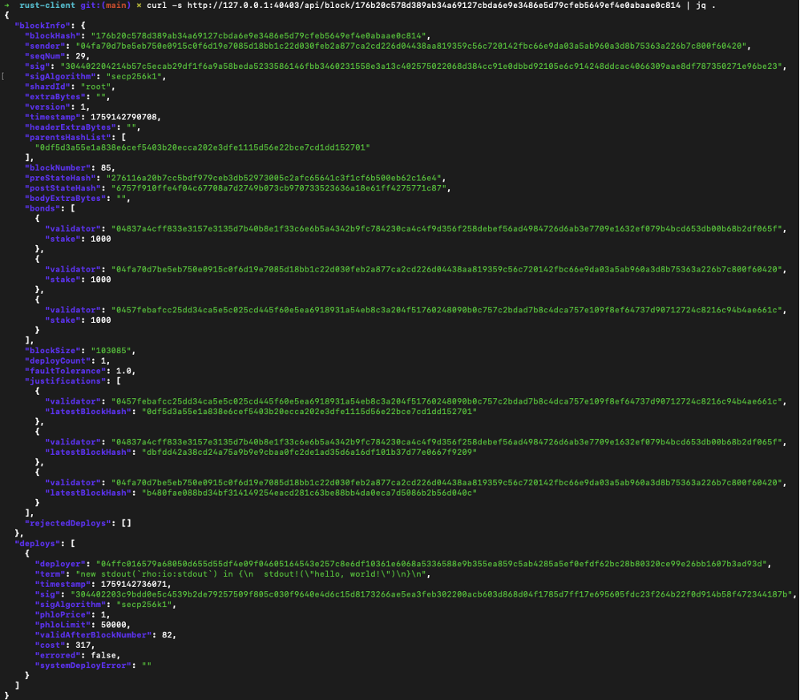

>**📝 NOTE**
Exact API paths and fields may differ depending on the build. Check your node’s OpenAPI spec`(curl -s http://127.0.0.1:40403/api/v1/openapi.json)` or your running service
### 🔍 Verification Checklist
- `get-deploy` reports Status: Included in block.
- Logs contain the expected output (for contracts using stdout).
- API confirms the deploy with a `blockHash` (optional but recommended).

If all three checks pass, your contract has been included in a block and produced the expected result.
 
 Diagram — illustration only, not executable code
*This diagram summarizes the flow described above.*

>**👉 NEXT**
**§6 Executing and Reading Results** — beyond simple logs, how can you observe richer contract behavior and interact with its outputs?

## 6.	Executing and Reading Results 
Deploying is only half the story. Now we want to observe what actually happened and extract results. 

In Rholang, “results” can surface in three places depending on how your contract is written: logs (stdout), a return (ack) channel (a one-off reply channel you pass into the contract), or persisted state (e.g., via the registry).

>**📝 NOTE**
The HTTP API returns deploy/block metadata (e.g., `blockHash, cost)`. **It does not contain stdout text** — use node logs to see stdout output.

>**⚠️ WARNING**
`stdout` is ephemeral and subject to log rotation. For durable results, persist state via the registry (and query it later), or design a query contract that reads and prints the stored value.

>**🔎 DEEP DIVE**
Rholang execution is a sequence of reductions: sends and receives meet on channels.
>- If your process sends to `stdout`, the message appears in logs when it meets the node’s stdout receive.
If you pass an ack channel, the contract can `!(result)` back to that channel; your calling flow (or helper contract) can then consume it.
>- If you persist via the registry, you store or look up a `name/URI` and can read it later (often by deploying a small query contract that performs lookup and prints to `stdout)`.

### Level 1 — Read from Logs (stdout)
For simple contracts like `hello.rho`, the output goes to stdout, which ends up in node logs.
Example (already deployed earlier):
```bash
new stdout(`rho:io:stdout`) in {
  stdout!("Hello, Shard!")
}
```

Check `logs (Docker)`   (run from `f1r3node/docker folder)`:
```bash
docker compose -f shard-with-autopropose.yml logs -f <SERVICE_NAME>
```
>**📝 NOTE**
Here `<SERVICE_NAME>` replaces validator1. To confirm, run:
```bash
docker compose -f shard-with-autopropose.yml ps
```

Expected line:
`Hello, Shard!`

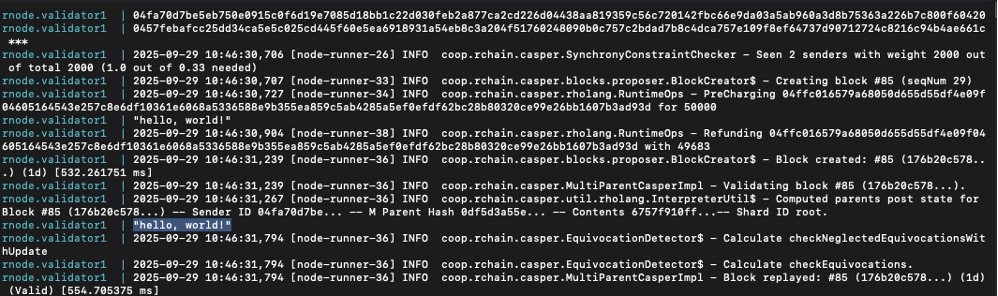

>**🔎 DEEP DIVE**
`stdout!(msg)` is a send; the node provides a matching receive on stdout. When they meet, a reduction happens and the message is printed to logs.

>**⚠️ WARNING**
Logs are transient and best for quick checks. For production-grade verification, combine logs with client/API checks (see §5), or use the patterns below (ack/registry) for durable results.
### Level 2 — Return (ack) Channel Pattern
For **function-like** results, use a **return channel** (often called ack): your contract sends the computed value back on a channel you control. You then **listen** on that channel and forward the value to logs (or elsewhere).
**Pattern:**
```bash
new ack, sum, stdout(`rho:io:stdout`) in {
  // A small function-like contract
  contract sum(@a, @b, ret) = { ret!(a + b) } |

  // Call it with a return channel
  sum!(2, 3, *ack) |

  // Read the result and print it
  for (@x <- ack) { stdout!(x) }
}
```
Expected logs:
`5`
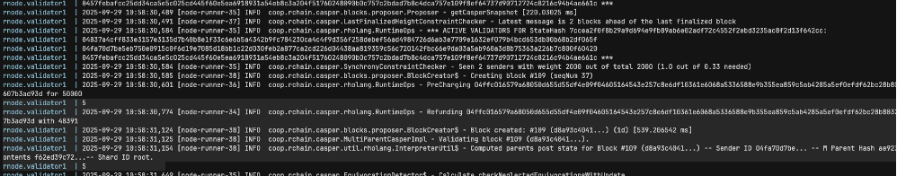

Why this works: the deploy creates a fresh, unforgeable channel ack, passes it into the contract, and then listens on it to receive the result.
>**📝 NOTE**
`stdout` output is ephemeral and may be lost due to log rotation. For durable verification, persist the result in the registry and read it via a query contract.

>**🔎 DEEP DIVE**
Fresh channels created with new are unforgeable names — other processes can’t guess them. This is the basis of secure, capability-style communication in Rholang.

>**💡 TIP (debugging):**
keep the `stdout!` forwarding while you iterate, then replace it with a production sink (e.g., write to registry) later.
### Level 3 — Persist and Query State (Registry)
If you want results that survive beyond logs, write to a named location and read it later with a second deploy. The global registry provides a simple name service.
#### Step A — Registry Insert
```bash 
new sum,
    ri(`rho:registry:insertArbitrary`), riReturn, 
    stdout(`rho:io:stdout`) in { 

        contract sum(@a, @b, return) = {
            stdout!(["calling sum(", a, b, ")"]) |
            return!(a + b)
        } |

        ri!(*sum, *riReturn) | stdout!(["Inserting ", *sum]) |

        for (@uri <- riReturn) { stdout!(["Inserted. URI ", uri]) | @"global-return-channel"!(uri) }

    }
```

##### Deployment
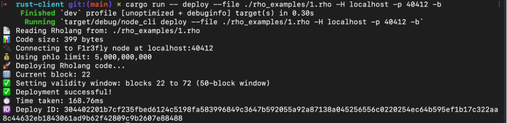

##### Logs
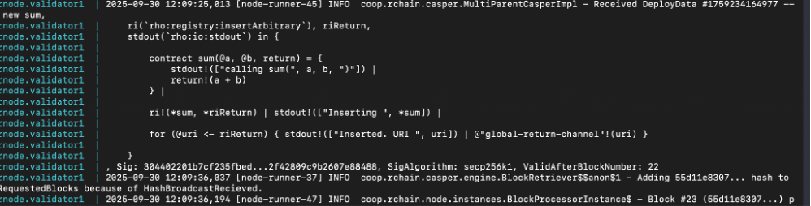

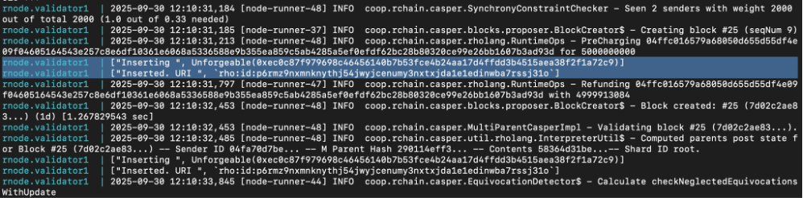

#### Step B – Registry Lookup
```bash
new rl(`rho:registry:lookup`),
    adder, testSumm, return,
    stdout(`rho:io:stdout`) in {

        for ( @uri <= @"global-return-channel" ) {
            stdout!(["find URI ", uri]) | 
            rl!(uri, *adder)
        } |

        for ( @sum <- adder ) { @sum!(1, 1, *return) } |

        for ( @sumReturn <- return ) { stdout!(["1 + 1 = ", sumReturn]) }
    }
```
##### Deployment
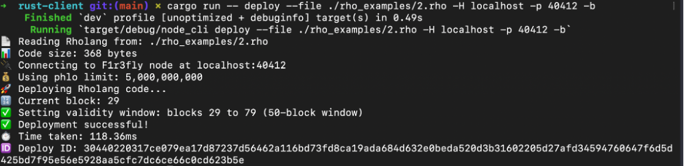

##### Logs
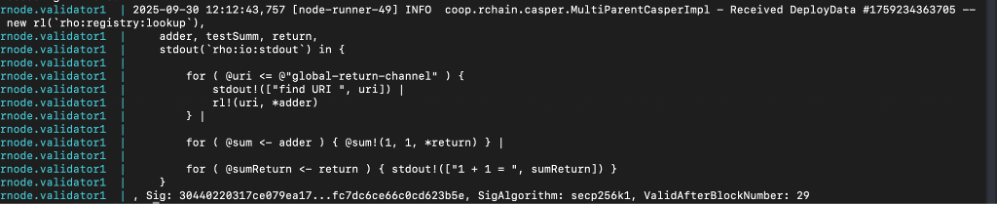

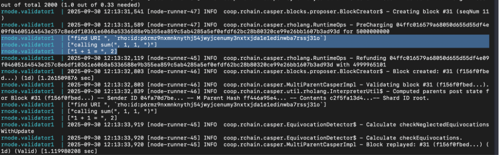


>**⚠️ WARNING**
If you see Computation ran out of phlogistons, increase the `phlo-limit` for your deploy.

>**🔎 DEEP DIVE**
Registry usage is just channels again: you bind a channel to a human-readable name, then resolve that name later to get back the channel. All communication is still sends/receives and reductions; the registry just gives you a place to find channels.

### API/Client Observability (Complementary to Patterns Above)
- Client status — already in §5:
```bash
cargo run -- get-deploy -d <DEPLOY_ID>
```
Confirms whether the deploy is included in a block and (optionally) shows metadata.

- HTTP API — machine-readable:
```baash
curl http://127.0.0.1:8080/api/deploy/<DEPLOY_ID>
```
Example (from §5):
`{ "blockHash":"…" }`

This JSON output can be consumed by scripts or monitoring tools. For example, a CI job can poll until a deploy is marked “Included in block,”or a dashboarding tool can visualize deploy/block counts over time.
>**📝 NOTE**
APIs typically **do not** return `stdout` text. To “read results,” either instrument contracts with return channels (Level 2) or persist data (Level 3) and query it with a second deploy.
### Troubleshooting Quick Wins


| **Symptom**                       | **Likely Cause**                     | **Fix** |
|----------------------------------|--------------------------------------|---------|
| `get-deploy` stays **pending**  | Shard didn’t propose yet             | Wait for next propose; ensure proposer is running. If **autopropose** is disabled, trigger propose manually. |
| No **Hello, Shard!** in logs     | Wrong container name or log level    | Check `docker compose ps`; use correct service (e.g., `<SERVICE_NAME>`). |
| No value from **ack channel**    | Contract didn’t send, or types mismatched | Verify the call signature; log every step with `stdout!`. Ensure the `for (@x <- ack)` listener is present in the same deploy. |
| Registry lookup **never returns** | Name not registered or typo          | Re-register and verify the exact name string. If you see **Computation ran out of phlogistons**, increase the **phlo-limit**. |


**Execution paths (`stdout / ack / registry)`.**


Diagram — illustration only, not executable code
*This diagram summarizes the flow described above.
**Troubleshooting Quick Wins**

Diagram — illustration only, not executable code

### Execution & Results Checklist

- Logs show simple output (stdout).
- Ack channel returns values you can observe.
- Registry stores a value you can read later with a second deploy.
- Client/API confirms inclusion in a block and provides metadata (cost, block hash).

>**🔎 DEEP DIVE**
All three patterns (logs, return channel, registry) are just variations on sends and receives. What changes is where you read the effects of reductions — console (ephemeral), a private channel you control (scoped), or a named location you can resolve later (persistent).

**👉 NEXT**
**§7 Common Errors & Fixes** — a compact table of real-world issues you’ll encounter while deploying and reading results, with one-line fixes and links back to the examples above.

## 7.	Common Errors & Fixes 

No matter how carefully you deploy, you will run into errors. Don’t panic — most of them are predictable and have simple fixes. Think of this section as your first-aid kit for Rholang deployment.
>**🔎 DEEP DIVE**
Rholang execution is just reductions — sends and receives meeting on channels. Errors usually come from two sides:
- Contract logic: mismatched sends/receives (e.g., sending on ack but never listening, or listening without a send).
- Environment setup: misconfigured ports, missing keys, or forgetting to propose.
Understanding both sides helps you debug fast

### Level 1 — Quick Wins (Beginner)
| **Error Message**                               | **Likely Cause**                            | **Quick Fix** |
|--------------------------------------------------|----------------------------------------------|---------------|
| `node not reachable`                             | Shard isn’t running or wrong URL             | Check node status endpoints:<br><br>`curl http://127.0.0.1:40403/status` — bootstrap<br>`curl http://127.0.0.1:40413/status` — validator1<br>`curl http://127.0.0.1:40423/status` — validator2<br>`curl http://127.0.0.1:40433/status` — validator3<br>`curl http://127.0.0.1:40443/status` — observer (optional)<br><br>Each node should report the correct number of peers. |
| `cargo: command not found`                       | Rust not installed or PATH unset             | Install Rust (`rustup`), then re-run cargo.<br><br>Example:<br>`curl https://sh.rustup.rs -sSf | sh` |
| `No such file: ./contracts/hello.rho`            | Contract path is wrong                       | Verify file exists; use correct `--file` path.<br><br>Example:<br>`ls ./contracts` |
| `Could not deploy, casper instance was not available yet.` | Node is still initializing after boot        | Wait a few minutes; if it persists >4 minutes, restart the node. |

Example: node not reachable error and successful retry after fixing URL.

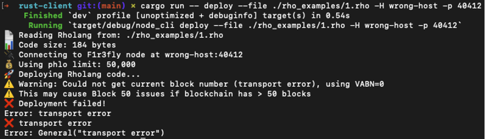


>**💡 TIP**
These “plumbing errors” are not about Rholang itself — they’re just setup issues. Fix them once, and you’ll rarely see them again.

### Level 2 — Language & Syntax Errors

| **Error Message**        | **Likely Cause**                               | **Quick Fix**                                      |
|--------------------------|------------------------------------------------|-----------------------------------------------------|
| Unexpected token `}`     | Syntax typo in `.rho` file                    | Check parentheses, braces, and nesting.            |
| Unbound variable         | Name used without `new` or contract definition | Declare variable or wrap in `new`.                 |
| Match error              | Wrong pattern in `for` or `match`              | Adjust pattern to match actual data sent.          |

**Example: Missing `new`**
```bash
stdout!("hi")   // ❌ Error: unbound name 'stdout'
```
**Fix:**
```bash
new stdout(`rho:io:stdout`) in {
  stdout!("hi")
}
```

>**🔎 DEEP DIVE**
Every send `(chan!(x))` must have a matching receive `(for(x <- chan))`, and vice versa. Syntax errors often block this reduction from happening. Always ensure your channels are bound (new) and patterns match expected values.

>**📝 NOTE**
Syntax errors will show up in your editor or compiler output. Any text editor with Rholang syntax highlighting (e.g., the F1R3FLY VS Code extension) can help.
### Level 3 — Advanced Issues (Deployment & Execution)
### Level 3 — Advanced Issues (Deployment & Execution)

| **Error Message**                     | **Likely Cause**                                     | **Quick Fix**                                                                                           |
|--------------------------------------|------------------------------------------------------|----------------------------------------------------------------------------------------------------------|
| Invalid deploy signature             | Wrong or missing private key                         | Re-check `.env`; use correct `<PRIVATE_KEY>`.                                                           |
| Deploy too large                     | Contract file size exceeds node limit                | Split contract; optimize; confirm config allows bigger contracts.                                       |
| get-deploy status stays Pending      | Proposer not running, or block not produced          | Ensure autopropose enabled; check proposer logs. If autopropose is disabled, trigger propose manually.  |
| Registry lookup never returns        | Name not registered, or typo in string               | Re-register channel; double-check exact string. Verify the exact URI.                                   |
| Computation ran out of phlogistons   | Insufficient tokens to execute Rholang (phlo limit too low) | Increase `phlo_limit`. When using the Rust client, pass `-b` or `--bigger-phlo` to raise the limit.      |


>**🔎 DEEP DIVE**
Many advanced errors come from capability mismanagement — using the wrong key, the wrong registry name, or mismatched contracts. Since Rholang relies on unforgeable names, any mismatch breaks the communication. Always confirm exact strings and keypairs.
### Troubleshooting Workflow (Cheat Sheet)
1.	Check the environment → Is the shard up? Is Rust installed?
2.	Check syntax → Run parser or deploy small snippets (hello.rho) first.
3.	Check execution → Use get-deploy, logs, and API.
4.	Check names & keys → Ensure correct private key and registry names.
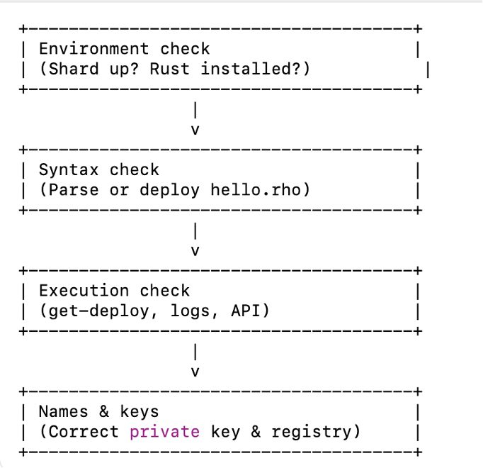

Diagram – illustration only, not executable code
*This diagram summarizes the flow described above*
### Error & Fix Checklist
- Environment is running (shard up, Rust installed).
- Contract syntax validated (no unbound names or typos).
- Deploys included in a block (not stuck Pending).
- Registry names and keys correct.

>**🔎 DEEP DIVE**
Most errors fall into two buckets:
>1.	Environment problems — the shard never accepts your deploy.
>2.	Contract logic problems — the deploy lands, but mismatched communication prevents reduction
Figure out which bucket you’re in early, and you’ll save hours of debugging.

>**👉 NEXT**
**§8 Next Steps** — where to go once you’ve deployed, verified, and debugged your first contracts: advanced workflows, multi-contract patterns, and security considerations.

## 8.	Next Steps 
Congratulations – if you’ve made it this far, you’ve gone from a brand-new shard environment to deploying, verifying, executing, and even debugging Rholang contracts. That’s a major milestone.

So what’s next? This section will guide you toward building more complex contracts, safer workflows, and production-ready applications — including multi-contract patterns and security best practices.
### Level 1 — Extend the Basics
Start by tweaking the examples you already know:
**Change the message:**
```bash
new stdout(`rho:io:stdout`) in {
  stdout!("Custom Message Here!")
}
```
**Experiment with arithmetic:**
```bash
new stdout(`rho:io:stdout`) in {
  stdout!(2 + 3 * 4)
}
```
**Play with concurrency:**
```bash
new stdout(`rho:io:stdout`) in {
  stdout!("One") | stdout!("Two") | stdout!("Three")
}
```
Expected output: order may vary → because contracts run concurrently.

>**💡 TIP**
Try running small experiments in quick succession. This builds intuition about concurrency and reduction.
### Level 2 — Build Stateful and Interactive Contracts
Move beyond static outputs:
**Stateful Counter**
```bash
new counter, stdout(`rho:io:stdout`) in {
  contract counter(@n) = {
    stdout!(n) |
    counter!(n + 1)
  } |
  counter!(0)
}
```

This prints an increasing sequence: `0, 1, 2, ….`

>**⚠️ WARNING**
This version runs endlessly and will keep printing numbers. In practice, add a stopping condition to avoid unbounded logs.

**Token-like Contract (simplified)**
```bash
new token, stdout(`rho:io:stdout`) in {
  contract token(@balance, ack) = {
    ack!(balance) |
    if (balance > 0) {
      token!(balance - 1, *ack)
    } else {
      Nil
    }
  } |
  new ack in {
    token!(10, *ack) |
    for(@b <= ack) { stdout!(["Balance: ", b]) }
  }
}
```
Logs showing `“Balance: 10”, then “Balance: 9”…`
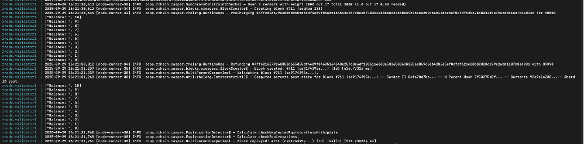

>**🔎 DEEP DIVE**
Stateful contracts use recursion to “carry” state forward. Each call spawns a new version of the process with updated values. This is the functional, concurrent way of managing state in Rholang.
### Level 3 — Towards Production: Patterns & Security
At this stage, focus on writing robust and secure contracts:
- **Use unforgeable names (new)** to enforce encapsulation.
- **Leverage the registry** for discoverability, but restrict sensitive channels.
- **Compose multiple contracts** (e.g., escrow + payment + registry).
- **Audit communication patterns** — every send must have a matching receive, and vice versa.
**Example: Escrow Pattern (simplified)**
```bash
new buyer, seller, escrow, stdout(`rho:io:stdout`) in {
  contract escrow(@amount, @from, @to) = {
    // funds released only if conditions met
    match amount {
      0 => { stdout!("Escrow complete") }
      _ => { escrow!(amount - 1, from, to) }
    }
  } |
  escrow!(5, *buyer, *seller)
}
```
**Expected output:**
`Escrow complete`
(after the countdown reaches zero)
>**⚠️ WARNING**
Real escrow involves cryptographic keys and conditions. This is just a sketch to show recursion + conditions.

>**🔎 DEEP DIVE**
Security in Rholang comes from capabilities, not global variables. Whoever holds an unforgeable name controls the right to communicate. Design your contracts so that only intended parties get access to sensitive channels.
### Next Learning Paths
- **Beginner:** Keep experimenting with simple contracts (Hello, arithmetic, concurrency). You can also try the REPL (experimental, when available) for faster feedback than shard + deployment.
- **Intermediate:** Dive into stateful and interactive contracts using recursion, registries, and return channels.
- **Advanced:** Explore the Rholang Reference & Cookbook with patterns like pub-sub hubs, registries, and token contracts.
_ **Developer Tools:** Use playgrounds and linters to test code quickly (and the REPL when stable).
- **Integration:** Learn how to connect Rholang contracts to off-chain APIs and services.
- **Security Audits:** Adopt best practices around unforgeable names and capability patterns.


Diagram – illustration only, not executable code
*This diagram summarizes the flow described above.*

### Checklist Before Moving On
- Modify & extend simple contracts
- Understand recursion and stateful design.
- Sketch multi-party workflows
- Recognize security considerations with unforgeable names.

👉 This wraps up **Part II — Deploying Rholang Code to a Shard**. You now have the foundation to:
🏗️ Write contracts
🚀 Deploy them
🔍 Verify execution
🛠️ Debug issues
🌐 Grow into production-level workflows


### Closing Note 

This guide is designed to be your one-stop resource — practical, complete, and easy to follow. Every step you need to succeed is here in one place.
At the same time, Firefly and Rholang are alive in active repositories. Many of the examples here (contracts, commands, and configs) come directly from those living projects. Exploring them will open up far more patterns, tests, and tools than we could fit in one guide — and will spark your curiosity to go further.
✨ So don’t stop here — keep tinkering, keep experimenting, and let your shard surprise you.

## Appendices
### Appendix A – Rholang Cookbook (Practical Patterns)

A quick-reference set of Rholang snippets you can copy, tweak, and deploy.
**Hello World (logs)**
```bash
new stdout(`rho:io:stdout`) in {
  stdout!("Hello, Shard!")
}
```
**Expected output:**
`Hello, Shard!`
**Echo (interactive)**
```bash
new echo, stdout(`rho:io:stdout`) in {
  for(@msg <- echo) { stdout!(msg) } |
  echo!("Ping!")
}
```
**Expected output:**
`Ping!`

**Return (ack) Channel**
```bash
new ack, sum, stdout(`rho:io:stdout`) in {
  contract sum(@a, @b, ret) = { ret!(a + b) } |
  sum!(2, 3, *ack) |
  for(@x <- ack) { stdout!(x) }
}
```
**Expected output:**
`5`
      
**Stateful Counter**
```bash
new counter, stdout(`rho:io:stdout`) in {
  contract counter(@n) = {
    stdout!(n) |
    counter!(n + 1)
  } |
  counter!(0)
}
```
**Expected output:**
`0
1
2
3
...`
>**⚠️ WARNING**
This version runs endlessly; in practice, add a stopping condition.
```bash
new ri(`rho:registry:insertArbitrary`),
    rl(`rho:registry:lookup`),
    stdout(`rho:io:stdout`),
    ack in {

  contract simpleInsertTest(registryIdentifier) = {
    new X, Y in {
      ri!(*X, *Y) |
      for(@uri <- Y) {
        stdout!(["Inserted URI: ", uri]) |
        registryIdentifier!(uri)
      }
    }
  } |

  contract simpleLookupTest(@uri, result) = {
    new lookupResponse in {
      rl!(uri, *lookupResponse) |
      for(@val <- lookupResponse) {
        stdout!(["Lookup result: ", val]) |
        ack!(val)
      }
    }
  }
}
```
**Advanced Debug Registry Test**
```bash
new simpleInsertTest, simpleInsertTestReturnID, 
    simpleLookupTest,
    signedInsertTest, signedInsertTestReturnID, 
    signedLookupTest, 
    ri(`rho:registry:insertArbitrary`), 
    rl(`rho:registry:lookup`),
    stdout(`rho:io:stdout`),
    stdoutAck(`rho:io:stdoutAck`), ack in { 

  simpleInsertTest!(*simpleInsertTestReturnID) |
  for(@idFromTest1 <- simpleInsertTestReturnID) {
    simpleLookupTest!(idFromTest1, *ack)
  } |

  contract simpleInsertTest(registryIdentifier) = {
    stdout!("REGISTRY_SIMPLE_INSERT_TEST: create arbitrary process X to store in the registry") |
    new X, Y, innerAck in {
      stdoutAck!(*X, *innerAck) |
      for(_ <- innerAck){
        stdout!("REGISTRY_SIMPLE_INSERT_TEST: adding X to the registry and getting back a new identifier") |
        ri!(*X, *Y) |
        for(@uri <- Y) {
          stdout!("@uri <- Y hit") |
          stdout!("REGISTRY_SIMPLE_INSERT_TEST: got an identifier for X from the registry") |
          stdout!(uri) |
          registryIdentifier!(uri)
        }
      }
    }
  } |

  contract simpleLookupTest(@uri, result) = {
    stdout!(["REGISTRY_SIMPLE_LOOKUP_TEST: uri = ", uri]) |
    stdout!("REGISTRY_SIMPLE_LOOKUP_TEST: looking up X in the registry using identifier") |
    new lookupResponse in {
      rl!(uri, *lookupResponse) |
      for(@val <- lookupResponse) {
        stdout!("REGISTRY_SIMPLE_LOOKUP_TEST: got X from the registry using identifier") |
        stdoutAck!(val, *result)
      }
    }
  }
}
```
>**💡 TIP**
Use this appendix like a “recipe book.” Try each snippet, then modify it for your own use cases.

### Appendix B – Troubleshooting Cheat Sheet


**Environment Issues**
- Shard not reachable → Check status endpoints:

 `curl http://127.0.0.1:40403/status (bootstrap)
 curl http://127.0.0.1:40413/status (validator1)
 curl http://127.0.0.1:40423/status (validator2)
 curl http://127.0.0.1:40433/status (validator3)`

- Rust client missing → Install with rustup: curl `https://sh.rustup.rs -sSf | sh`
-Wrong file path → Verify `--file ./contracts/your.rho (verify ls ./contracts)`

**Syntax Issues**
- “Unbound variable” → Forgot to declare with new.

- “Unexpected token” → Misplaced braces or parentheses.

- Match error → Pattern doesn’t match the sent message shape (adjust pattern in for/match).

**Execution Issues**
- Status stays Pending → Proposer not running / block not produced (enable autopropose or trigger propose manually).
- Registry lookup fails → URI string typo or name not registered (re-register; use the exact URI).
- Invalid signature → Wrong private key (re-check `.env / <PRIVATE_KEY>`).
**Troubleshooting Flow**


Diagram – illustration only, not executable code
*This diagram summarizes the flow described above.*

### Appendix C – Advanced Concepts (Deep Dive)

- **Reductions:** Every Rholang computation is a reduction — a send meeting a matching receive.
- **Unforgeable Names:** Channels created with new are secure; only holders of the name can use them.
- **Capabilities:** Access control in Rholang is managed by passing names, not by global variables.
- **Concurrency Model:** Multiple processes reduce in parallel; outputs may interleave in different orders between runs.
>**📝 NOTE**
You don’t need these details to run contracts, but they’re critical to design robust, secure applications.

### Appendix D – Pending Questions for Developers

While this guide is production-ready, a few points should be validated with the Firefly/Rholang team:
- **Query API** → Is there an official supported way to query contract state directly (besides logs/registry)?
- **REPL / Playground** → Will developers get an official REPL or hosted playground for testing?
- **Registry Best Practices** → Which registry usage patterns should be shown as canonical examples?
- **Contract Limits** → What are the current size and cost limits for deploys (especially for large contracts)?
- **Future Tooling** → Which advanced methods (Scala node, IaC) will remain supported, and which are research-only.
>**💡 TIP**
These questions should be confirmed with the Firefly/Rholang dev team before final publication — answering them ensures the guide stays accurate and authoritative.
 
### Appendix E – Sources & Further Reading

This guide is designed to be practical and self-contained — you can follow all steps here without referring to other documents.

At the same time, Firefly and Rholang live in active repositories. Many examples (contracts, commands, configs) come directly from there. Exploring them opens far more patterns, tests, and tools than we could fit into one guide.
#### Rholang Examples & Corpus
**Repository:** `https://github.com/F1R3FLY-io/f1r3node/tree/main/rholang/examples`
**Content:** A broad collection of `.rho` contracts used in examples and tests — hello world, echo, counters, registries, tokens, error cases, and more.
**Useful for:** discovering additional “cookbook” contracts and learning from test-driven examples.
#### Rust Client (Canonical Deployment Tool)
**Repository:** `https://github.com/F1R3FLY-io/rust-client/`
**Location:** `README.md, src/main.rs`
**Content:** Official commands for `deploy, get-deploy, status, etc.`
**Useful for:** verifying client command syntax and exploring full CLI options.
#### Firefly Node & Docker Configs
**Repository:** `https://github.com/F1R3FLY-io/f1r3fly`
**Location:** `docker/`
**Content:** Docker Compose configs, example service setups, pointers to API endpoints.
**Useful for:** understanding containerized shards, checking service names (e.g., validator1), and aligning local setup.
#### Node HTTP API (OpenAPI spec)
**Endpoint (local dev):** `http://127.0.0.1:40403/api/v1/openapi.json`
**Useful for:** exploring available endpoints and understanding expected request/response formats.
>**💡 TIP**
If you like learning from raw repos and tests, these sources are your playground — they show a wider universe of patterns and tooling than any single guide can cover.

>**👉 [NEXT Part III — Integrating External Resources into Rholang](./part-03-integrating-external-resources-into-rholang.md)**
>Part III describes how Rholang interacts with external tools and services.  
It covers the supported integration points, configuration basics, and practical examples of wiring Rholang contracts to external data and infrastructure.
